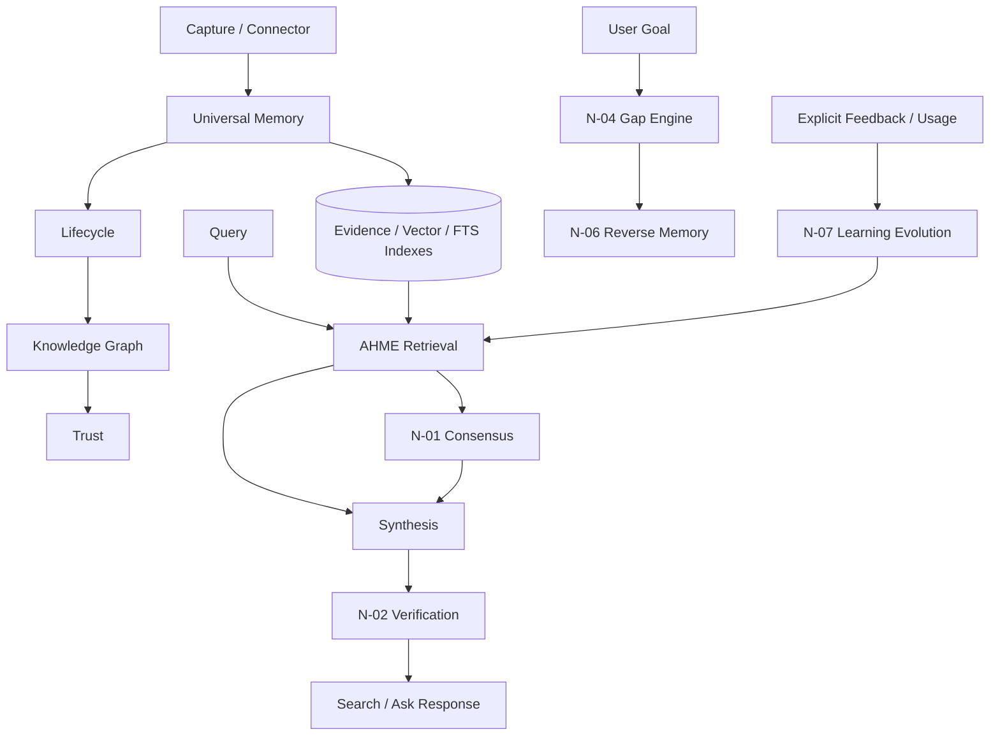

# KNOWLEDGE ENGINE — Architecture Specification

**Purpose:** Define the Memory Search knowledge-intelligence layer and its validated execution boundaries.  
**Status:** Reconciled against executable implementation and accepted closeouts.  
**Last updated:** 2026-08-30  
**Code anchors:** `app/services/ahme_engine.py`, `universal_memory_service.py`, `trust_engine.py`, `knowledge_graph_service.py`, `verification_engine.py`, `consensus_engine.py`, `gap_agent.py`, `reverse_memory_service.py`, `learning_evolution_service.py`

---

## 1. Overview

The Knowledge Engine transforms captured material into structured, retrievable, trustworthy knowledge while keeping deterministic behavior available without mandatory AI.

```text
Capture
  → Universal Memory (F-36)
  → Lifecycle (F-37)
  → Capsule / Index
  → Knowledge Graph (F-33)
  → Trust (F-38)
  → Retrieve (AHME)
  → Verify (N-02)
  → Consensus when applicable (N-01)
  → Synthesize / Explain
  → Learn from bounded feedback (N-07)

Goals → Gap Engine (N-04) → Reverse Memory (N-06)
```

| Engine | Status | Validated role |
|---|---|---|
| **Universal Memory Schema** | ✅ Implemented (F-36) | Canonical normalized object across sources |
| **Memory Lifecycle** | ✅ Implemented (F-37) | Deterministic state machine + audit trail |
| **Trust Engine** | ✅ Foundation complete (F-38) | Persisted confidence/trust components |
| **Knowledge Graph** | ✅ Acceptance-complete (F-33) | Tenant-scoped entities, relations, temporal facts, merge review |
| **AHME** | ✅ Implemented | Hierarchical hybrid retrieval with safe flat fallback |
| **Memory Capsules** | ✅ Implemented | Structured summaries and sections |
| **Verification Engine** | ✅ Acceptance-complete (N-02) | Claim-level evidence verification |
| **Consensus Engine** | ✅ Acceptance-complete (N-01) | Explicit cross-source agreement/conflict handling |
| **Gap Engine** | ✅ Acceptance-complete (N-04) | Evidence-backed goal coverage gaps |
| **Reverse Memory** | ✅ Acceptance-complete (N-06) | Grounded “what should I learn next?” actions |
| **Learning Evolution** | ✅ Acceptance-complete (N-07) | Bounded tenant-local ranking evolution without re-ingest |

Status here means the repository-controlled acceptance boundary is implemented and validated. Optional future enhancements remain future work unless separately promoted in `MASTER_SPEC.md` / `FEATURE_IDEAS.md`.

---

## 2. AHME — Adaptive Hierarchical Memory Engine

### 2.1 Purpose

Coarse-to-fine retrieval that scales beyond scanning every chunk, adapts to query intent, and falls back safely when the hierarchical path is unavailable.

### 2.2 Status: **Implemented**

**Module:** `AdaptiveHierarchicalMemoryEngine` (`app/services/ahme_engine.py`)  
**Flag:** `hierarchical_retrieval_enabled`

### 2.3 Pipeline

```text
Query
  → QueryRouter
  → SemanticCache lookup
  → Capsule retrieval
  → source narrowing
  → Section retrieval
  → Evidence retrieval (vector + FTS)
  → RRF fusion
  → MMR diversification
  → deterministic deduplication
  → ranked evidence + metrics
```

On hierarchical failure the engine falls back to flat chunk retrieval. With the feature flag disabled, the flat path remains available.

### 2.4 Core components

| Component | Module | Role |
|---|---|---|
| Query router | `query_router.py` | Classifies query type for ranking behavior |
| Hierarchical store | `hierarchical_store.py` | Capsule / section CRUD and search |
| FTS index | `fts_index.py` | SQLite FTS lexical retrieval |
| RRF | `rrf.py` | Rank fusion |
| MMR | `mmr.py` | Redundancy reduction |
| Semantic cache | `semantic_cache.py` | Similar-query cache |
| Dedup | `deduplication_service.py` | Deterministic content/chunk deduplication |

### 2.5 Data touched

- Chroma: `memory_items`, `memory_capsules`, `memory_sections`
- SQLite in the local/single-node profile: FTS, semantic cache, registry/dedup metadata
- Every user-visible retrieval path propagates tenant identity where multi-user mode is enabled.

### 2.6 Acceptance criteria

- [x] Hierarchical path returns evidence with metrics
- [x] Flat fallback on error
- [x] Cache invalidates on index-version changes
- [x] User-scoped search when `user_id` is present

---

## 3. Memory Capsules

### 3.1 Purpose

Compress an item into structured memory metadata for fast routing before evidence-level retrieval.

### 3.2 Status: **Implemented**

**Module:** `capsule_service.py`  
**Models:** `MemoryCapsule`, `MemorySection`

Capsules can be built deterministically; optional AI enrichment is not required for the core path. They preserve topics/entities, procedures/components where detectable, section boundaries, claims, and reflection fields such as save reason and user goal.

### 3.3 Acceptance criteria

- [x] Deterministic capsule without LLM
- [x] Sections align to source evidence segments
- [x] Reflection metadata is preserved when provided

---

## 4. Verification Engine — N-02

### 4.1 Purpose

Ensure chat answers are traceable to retrieved evidence instead of treating fluent synthesis as proof.

### 4.2 Status: **Acceptance-complete**

**Modules:** `app/services/verification_engine.py`, `app/models/verification.py`, `app/services/chat_service.py`

The implemented pipeline deterministically segments answer sentences into claims and assigns `supported`, `uncertain`, or `unsupported`. Supported and uncertain claims retain evidence IDs. Numeric claims are penalized when the cited evidence does not contain the asserted factual number. Chat responses expose aggregate verification score, per-claim status, evidence IDs, and supported/uncertain/unsupported counts.

Verification runs after both deterministic and optional-provider synthesis, so enabling an LLM does not bypass the evidence gate.

### 4.3 Acceptance criteria

- [x] Every answer sentence maps to evidence or is explicitly flagged
- [x] Unsupported claims are labeled rather than silently treated as grounded
- [x] API exposes `verification: { score, claims: [...] }`
- [x] Adversarial regressions cover fabricated claims, numeric mismatches, mixed support, and empty answers

### 4.4 Scope boundaries

Source freshness remains part of trust/freshness work. Cross-source contradiction reconciliation belongs to N-01 Consensus. Those are not prerequisites for N-02 claim-to-evidence acceptance.

Closeout: `docs/N02_VERIFICATION_CLOSEOUT.md`.

---

## 5. Consensus Engine — N-01

### 5.1 Purpose

When retrieved sources disagree, preserve the disagreement explicitly rather than manufacturing a single confident answer.

### 5.2 Status: **Acceptance-complete**

**Module:** `app/services/consensus_engine.py`  
**Integration:** `ChatService` for comparison / cross-source queries

The deterministic engine operates only over already-retrieved tenant-scoped evidence. Source independence is keyed by canonical source identity so multiple chunks from one source cannot create false consensus. Numeric and negation mismatches are represented as explicit conflict sides. Agreement weight is based on independent supporting sources.

When a conflict is detected, the response preserves both source titles/claims and the normal citation/evidence list instead of merging contradictory claims into one sentence. The Ask workspace exposes consensus status, consensus weight, independent source count, and conflict sides.

### 5.3 Acceptance criteria

- [x] Comparison queries surface both sides with citations/evidence
- [x] Consensus weight and independent source count are visible in the Ask UI
- [x] Contradictory claims are not merged into one sentence
- [x] Same-source duplicate chunks do not inflate consensus

### 5.4 Safety

- deterministic and tenant-scoped
- no external research fetch inside the engine
- no autonomous memory mutation
- no mandatory LLM call

Closeout: `docs/closeouts/N01_CONSENSUS_ENGINE_CLOSEOUT.md`.

---

## 6. Trust Engine — F-38

### 6.1 Purpose

Persist interpretable trust/confidence components so retrieval and future policy layers can distinguish stronger and weaker memories.

### 6.2 Status: **Foundation complete**

**Module:** `TrustEngine` (`app/services/trust_engine.py`)  
**Persistence:** memory trust snapshot + trust history

The current scoring foundation combines source reliability, freshness, verification, evidence strength, and bounded feedback into an overall score/tier. Disputed material is capped rather than promoted by other components.

### 6.3 Validated foundation

- [x] Component scores persisted for ingested memories
- [x] Trust history appended on recompute
- [x] Lifecycle can advance to trusted based on the configured score boundary

### 6.4 Explicit future enhancements

The following are not claimed complete merely by F-38 foundation status:

- richer consensus-weighted trust policies
- additional trust-aware search controls beyond already validated surfaces
- future agent policy tiers

These must be audited against their own source-of-truth rows before promotion.

---

## 7. Knowledge Graph & Entity Intelligence — F-33

### 7.1 Purpose

Connect entities and facts across memories while preserving tenant ownership, provenance, deterministic merge behavior, and explicit approval for destructive/rewiring operations.

### 7.2 Status: **Acceptance-complete**

**Modules:** `KnowledgeGraphStore`, `KnowledgeGraphService`, `EntityMergeService`  
**Core data:** graph entities, relations, memory links, temporal relation bounds

### 7.3 Validated behavior

- tenant-scoped entities, relations, and memory links
- ingest-time automatic linking
- entity search and bounded neighbor traversal
- temporal facts with half-open `valid_from` / `valid_to` filtering and historical neighbor queries
- deterministic entity merge that rewires links/relations, collapses duplicates, preserves strongest confidence/evidence metadata, aliases and merged IDs
- same-type and tenant constraints; memory-entity merges rejected
- visible Entity Merge Review UI
- literal `confirm: true` required at the generic merge API boundary; omitted/false confirmation is rejected before mutation

### 7.4 Acceptance criteria

- [x] Entities/relations are tenant-scoped
- [x] Auto-link on ingest
- [x] Entity search + neighbors
- [x] Temporal facts
- [x] Entity merge/dedup review UI with explicit confirmation

### 7.5 Future enhancement

Graph-powered retrieval inside AHME remains a separate future enhancement and is not required to claim the F-33 acceptance boundary complete.

Closeout: `docs/closeouts/F33_KNOWLEDGE_GRAPH_CLOSEOUT.md`.

---

## 8. Universal Memory Schema — F-36

### 8.1 Status: **Implemented**

`UniversalMemory` provides canonical identity and normalized fields across source types, including tenant, source type/external ID, canonical URL, lifecycle/verification state, provenance, embedding refs, trust, metadata, relationships, versions and timestamps.

`UniversalMemoryService` orchestrates capture/finalization while `MemoryStore` persists canonical records and version history.

### 8.2 Acceptance criteria

- [x] Deterministic uniqueness for `(user_id, source_type, external_id)`
- [x] Version snapshots on content change
- [x] Ingest path writes canonical memory state after successful indexing

---

## 9. Memory Lifecycle — F-37

### 9.1 Status: **Implemented**

The lifecycle service enforces the documented capture → parse/enrich/embed/connect/verify/trust progression plus archive/revive/merge paths. Every transition records actor, reason, previous state, next state, and timestamp.

### 9.2 Acceptance criteria

- [x] Invalid transitions rejected
- [x] Ingest advances through the validated pipeline automatically
- [x] Archive/revive operations are exposed through authenticated boundaries

---

## 10. Gap Engine — N-04

### 10.1 Purpose

Detect evidence-backed holes in the user's saved knowledge relative to explicit goals.

### 10.2 Status: **Acceptance-complete**

The current deterministic Gap Agent analyzes only the authenticated tenant's reflection-goal data. It includes explicitly requested goals even when zero memories exist and grounds findings in observable coverage, source diversity, and stale/never-reviewed state.

It deliberately does **not** invent arbitrary missing curriculum topics when the repository has no ontology/evidence for them.

### 10.3 Acceptance boundary

- [x] Explicit zero-memory goals produce grounded coverage/diversity gaps
- [x] Findings retain evidence such as memory count, source count, or review state
- [x] Sufficiently covered/recently reviewed goals do not produce false gaps
- [x] Tenant isolation is enforced
- [x] Output is deterministic and requires no AI/network fetch/autonomous write

Closeout: `docs/closeouts/N04_GAP_ENGINE_CLOSEOUT.md`.

---

## 11. Reverse Memory — N-06

### 11.1 Purpose

Answer “what should I learn next for goal G?” using grounded knowledge gaps rather than invented recommendations.

### 11.2 Status: **Acceptance-complete**

`ReverseMemoryService` consumes deterministic Gap Agent evidence. It can recommend beginning foundational coverage for zero-memory goals, reviewing stale existing knowledge first, or increasing coverage/source diversity only when the corresponding gap exists. A goal that already meets the configured thresholds receives no unnecessary suggestion.

### 11.3 Acceptance boundary

- [x] Explicit goals produce deterministic next-learning actions from N-04 evidence
- [x] Zero-memory recommendations record zero-memory evidence
- [x] Stale review is prioritized when applicable
- [x] Well-covered goals are suppressed
- [x] Tenant isolation is preserved
- [x] No network fetch, autonomous write, or mandatory AI

Closeout: `docs/closeouts/N06_REVERSE_MEMORY_CLOSEOUT.md`.

---

## 12. Learning Evolution — N-07

### 12.1 Purpose

Allow retrieval ranking to improve from bounded user usage/feedback without full re-ingest or mutation of the original evidence score.

### 12.2 Status: **Acceptance-complete**

`LearningEvolutionService` converts tenant-local explicit helpful/not-helpful feedback and weaker view signals into a small deterministic ranking adjustment. Search counts are excluded to avoid self-reinforcing retrieval. The learned influence is capped so it can resolve close ranking ties without rescuing weak evidence.

`SearchService` retains the original relevance/similarity score for auditability and applies the learning signal as a separate additive layer. Learning-metadata failure is fail-open: core retrieval continues.

### 12.3 Acceptance boundary

- [x] Ranking can evolve after later tenant-local feedback without re-ingest
- [x] Original evidence scores remain unchanged
- [x] Positive/negative influence is bounded
- [x] Search retrieval does not train itself through search-count reinforcement
- [x] Tenant isolation and fail-open core retrieval are tested
- [x] No mandatory AI or autonomous content mutation

Closeout: `docs/closeouts/N07_LEARNING_EVOLUTION_CLOSEOUT.md`.

---

## 13. Intelligence interaction rules

The accepted engines compose in a deliberately constrained way:

1. Retrieval produces tenant-scoped evidence.
2. Synthesis may be deterministic or optional-AI, but citations/evidence remain first-class.
3. N-02 verifies claims against retrieved evidence.
4. N-01 runs only where comparison/cross-source reasoning is applicable and preserves conflicts.
5. Trust remains an interpretable persisted signal rather than a substitute for evidence.
6. N-04 detects only evidence-backed goal gaps.
7. N-06 converts those grounded gaps into next-learning actions.
8. N-07 changes ranking only through bounded, tenant-local feedback signals.

No engine in this accepted Memory Search layer authorizes irreversible writes by itself. Where entity merge mutates graph structure, the explicit confirmation boundary remains mandatory.

---

## 14. Architecture diagram



---

## 15. Validated dependency order

```text
1. Universal Memory + Lifecycle + Trust + Graph foundation — done
2. Memory Capsules + AHME — done
3. N-02 Verification — done
4. Durable Event Bus foundation — done (runtime/platform closeout)
5. N-01 Consensus — done
6. N-04 Gap → N-06 Reverse Memory — done
7. N-07 Learning Evolution — done
```

This dependency completion does **not** by itself authorize a Jarvis transition. Remaining Memory Search source-of-truth rows, platform gaps, trust/cross-source-dedup work, UX acceptance items, and final stability criteria must still be completed/reconciled first.

---

## 16. Related documents

| Document | Purpose |
|---|---|
| `MASTER_SPEC.md` | Canonical feature inventory / phases / gates |
| `FEATURE_IDEAS.md` | Backlog and acceptance summaries |
| `AGENT_BIBLE.md` | Agent catalog and approval policies |
| `CONNECTOR_SDK.md` | Connector ingestion contract |
| `docs/CURRENT_BUILD_STATE.md` | Active reconciliation/build-state ledger |
| `docs/SOURCE_OF_TRUTH_RECONCILIATION.md` | Evidence-led reconciliation ledger |
| `docs/N02_VERIFICATION_CLOSEOUT.md` | N-02 evidence |
| `docs/closeouts/N01_CONSENSUS_ENGINE_CLOSEOUT.md` | N-01 evidence |
| `docs/closeouts/N04_GAP_ENGINE_CLOSEOUT.md` | N-04 evidence |
| `docs/closeouts/N06_REVERSE_MEMORY_CLOSEOUT.md` | N-06 evidence |
| `docs/closeouts/N07_LEARNING_EVOLUTION_CLOSEOUT.md` | N-07 evidence |
| `docs/closeouts/F33_KNOWLEDGE_GRAPH_CLOSEOUT.md` | F-33 evidence |

Jarvis-specific voice, vision, gesture, spatial/holographic, ambient-capture, and hardware-interface work remains out of scope until the separate Memory Search completion/stability transition gate is satisfied.
