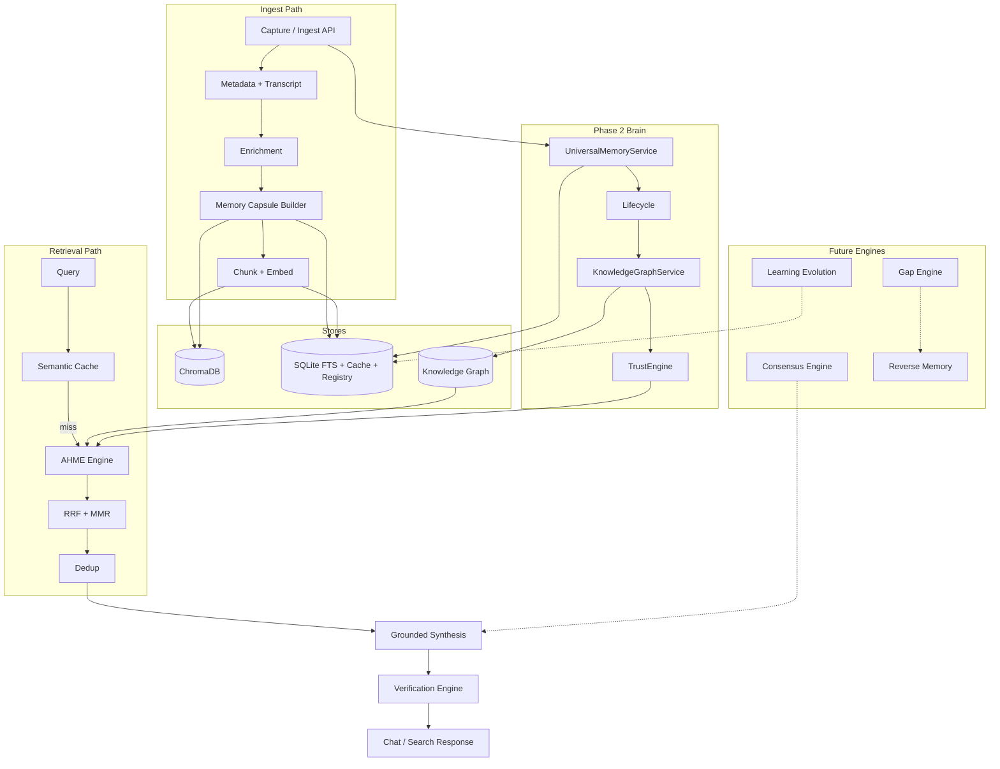

# KNOWLEDGE ENGINE — Architecture Specification

**Purpose:** Define the memory intelligence layer — implemented (AHME) and planned engines.  
**Status:** Architecture phase — engines marked **Implemented** exist in code; others are spec-only.  
**Last updated:** 2026-07-21  
**Code anchors:** `app/services/ahme_engine.py`, `universal_memory_service.py`, `trust_engine.py`, `knowledge_graph_service.py`, `memory_lifecycle_service.py`

---

## 1. Overview

The Knowledge Engine is the **reasoning substrate** of AI Memory OS. It transforms raw captures into structured, retrievable, trustworthy knowledge.

```
Capture → Universal Memory (F-36) → Lifecycle (F-37) → Capsule → Index → Graph (F-33) → Trust (F-38)
  → Retrieve (AHME) → Verify → Synthesize → Learn
```

| Engine | Status | Role |
|--------|--------|------|
| **Universal Memory Schema** | ✅ Implemented (F-36) | Normalized object for all sources |
| **Memory Lifecycle** | ✅ Implemented (F-37) | State machine + audit trail |
| **Trust Engine** | ✅ Foundation (F-38) | Scoring + persistence |
| **Knowledge Graph** | ⚠️ Foundation (F-33) | Entities, relations, graph APIs |
| **AHME** | ✅ Implemented | Hierarchical hybrid retrieval |
| **Memory Capsules** | ✅ Implemented | Structured summaries per item |
| **Verification Engine** | ⚠️ Partial | Grounding checks on answers |
| **Consensus Engine** | 📋 Planned | Reconcile conflicting sources |
| **Gap Engine** | 📋 Planned | Detect missing knowledge |
| **Reverse Memory** | 📋 Planned | Recommend what to learn |
| **Learning Evolution** | 📋 Planned | Improve memory over time |

---

## 2. AHME — Adaptive Hierarchical Memory Engine

### 2.1 Purpose

Coarse-to-fine retrieval that scales to large personal libraries without scanning every chunk. Adapts to query intent and falls back safely.

### 2.2 Status: **Implemented**

**Module:** `AdaptiveHierarchicalMemoryEngine` (`app/services/ahme_engine.py`)  
**Flag:** `hierarchical_retrieval_enabled` (default `true`)

### 2.3 Pipeline

```
Query
  → QueryRouter (intent: procedural, comparison, conceptual, …)
  → SemanticCache lookup (optional hit)
  → Capsule retrieval (Chroma memory_capsules)
  → Video narrowing (top videos)
  → Section retrieval (Chroma memory_sections)
  → Evidence retrieval (Chroma memory_items + FTS5 hybrid)
  → RRF fusion (vector ranks + FTS ranks)
  → MMR diversification
  → Deduplication (content hash / simhash)
  → Return ranked evidence chunks + SearchMetrics
```

On any hierarchical failure → **flat fallback** (direct chunk search).  
When flag off → **flat mode** only.

### 2.4 Components

| Component | Module | Function |
|-----------|--------|----------|
| Query router | `query_router.py` | Classify query type for ranking tweaks |
| Hierarchical store | `hierarchical_store.py` | Capsule/section CRUD + level search |
| FTS index | `fts_index.py` | SQLite FTS5 lexical search |
| RRF | `rrf.py` | `reciprocal_rank_fusion` |
| MMR | `mmr.py` | `mmr_select` — reduce redundancy |
| Semantic cache | `semantic_cache.py` | Cosine similarity on question embeddings |
| Dedup | `deduplication_service.py` | Transcript/chunk hash reuse |

### 2.5 Configuration

| Setting | Default | Effect |
|---------|---------|--------|
| `capsule_top_k` | 8 | Capsule candidates |
| `video_top_k` | 4 | Videos after capsule filter |
| `section_top_k` | 6 | Sections per video |
| `evidence_top_k` | 8 | Final evidence chunks |
| `rrf_k` | 60 | RRF constant |
| `mmr_lambda` | 0.7 | Relevance vs diversity |
| `semantic_cache_enabled` | true | Cache on/off |
| `semantic_cache_similarity_threshold` | 0.92 | Hit threshold |

### 2.6 Data touched

- Chroma: `memory_items`, `memory_capsules`, `memory_sections`
- SQLite: `memory_fts`, `semantic_cache`, `content_hashes`, `chunk_hashes`
- Metadata filter: `user_id` when provided

### 2.7 Tests & benchmarks

- `tests/test_ahme.py` (~20 cases)
- `scripts/benchmark_ahme.py` → `docs/BENCHMARK_AHME.md`

### 2.8 Acceptance criteria (met)

- [x] Hierarchical path returns evidence with metrics  
- [x] Flat fallback on error  
- [x] Cache invalidates on index version bump  
- [x] User-scoped search when `user_id` set  

---

## 3. Memory Capsules

### 3.1 Purpose

Compress a video into a **structured memory object** — topics, entities, procedures, sections — for fast routing before chunk-level search.

### 3.2 Status: **Implemented**

**Module:** `capsule_service.py` — `build_capsule_deterministic()` + optional LLM path  
**Model:** `MemoryCapsule`, `MemorySection` (`app/models/capsule.py`)

### 3.3 Capsule schema (logical)

| Field | Source |
|-------|--------|
| `one_line_memory` | EnrichmentService |
| `short_summary` | Transcript excerpt |
| `topics`, `entities` | Keyword/regex extraction |
| `tools_or_components`, `procedures` | Pattern extraction (e.g. PC build) |
| `claims` | Sentence-level claims list |
| `sections[]` | Time-bounded transcript segments |
| Reflection fields | `save_reason`, `user_goal`, `difficulty`, `content_style` |

### 3.4 Storage

- JSON: SQLite `memory_capsules_json`
- Vectors: Chroma `memory_capsules` collection (embedded capsule summary)
- Sections: Chroma `memory_sections` + FTS rows

### 3.5 Ingest integration

Generated during `IngestService` after transcript + enrichment; stored before chunk upsert.

### 3.6 Acceptance criteria (met)

- [x] Deterministic capsule without LLM  
- [x] Sections align to transcript segments  
- [x] Reflection metadata embedded when provided  

---

## 4. Verification Engine

### 4.1 Purpose

Ensure answers and agent outputs are **supported by retrieved evidence**, not invented.

### 4.2 Status: **Partial** (grounding validation only)

**Implemented today:**

- `grounded_synthesis._validate_grounding()` — token overlap between answer and evidence corpus  
- `DeterministicAnswerGenerator` — marks insufficient evidence  
- `ChatService` — returns `grounded: bool` + sources with timestamp URLs  

**Not yet implemented:**

- Per-claim verification  
- Source freshness checks  
- Contradiction detection  

### 4.3 Target architecture (planned)

```
StructuredAnswer / Agent output
  → Claim segmentation
  → For each claim: link to evidence_id(s)
  → Verification score per claim (supported / unsupported / uncertain)
  → Aggregate → response confidence + UI badges
```

### 4.4 Acceptance criteria (future)

- [ ] Every sentence in chat answer maps to ≥1 evidence_id or is flagged  
- [ ] Unsupported claims stripped or labeled  
- [ ] API field: `verification: { score, claims: [...] }`  
- [ ] Tests with adversarial LLM outputs  

**Priority:** P1 · **Depends on:** F-12, F-16 · **ID:** N-02

---

## 5. Consensus Engine

### 5.1 Purpose

When multiple memories disagree (e.g. two creators give different advice), produce a **balanced answer** with explicit disagreement — not false certainty.

### 5.2 Status: **Planned**

### 5.3 Architecture (spec)

```
Question + retrieved evidence (grouped by source/video)
  → Claim extraction per source
  → Cluster semantically similar claims
  → Detect conflict clusters (negation / numeric mismatch)
  → Build consensus view:
       - agreement_set (cited by N sources)
       - disagreement_pairs (A says X, B says Y)
       - single_source (low consensus weight)
  → Synthesis template or LLM with structured conflict section
```

### 5.4 Data model (planned)

```text
consensus_clusters (
  cluster_id, query_hash, claim_text, supporting_video_ids[], opposing_video_ids[], weight
)
```

### 5.5 Acceptance criteria (future)

- [ ] Comparison queries surface both sides with citations  
- [ ] Consensus weight visible in UI  
- [ ] No merge of contradictory claims into one sentence  

**Priority:** P2 · **Depends on:** N-05, F-09 · **ID:** N-01

---

## 6. Trust Engine

### 6.1 Purpose

Assign **trust scores** to memories so users and future agents know what to rely on.

### 6.2 Status: **Foundation complete** (F-38)

**Module:** `TrustEngine` (`app/services/trust_engine.py`)  
**Persistence:** `memory_records.trust_snapshot_json`, `memory_trust_history`  
**Integration:** `UniversalMemoryService.finalize_ingest()` computes trust after verification stage

### 6.3 Scoring model (implemented)

| Component | Weight in confidence | Logic |
|-----------|---------------------|--------|
| `source_reliability` | 20% of confidence | Lookup by `source_type` (YouTube 0.78, web 0.62, …) |
| `freshness` | 15% | Age buckets from `published_at` / `updated_at` |
| `verification` | 25% | Maps `VerificationStatus` enum |
| `evidence_strength` | 40% | Chunk count + capsule bonus |
| `overall` | confidence ± feedback | Capped at 0.35 if `DISPUTED` |

**Tiers:** `trusted` (≥0.62), `moderate`, `single_source`, `low`, `disputed`

### 6.4 API

- `GET /api/v1/memories/{memory_id}/trust`
- Trust history: `MemoryStore.list_trust_history()`

### 6.5 Acceptance criteria (met)

- [x] Five component scores persisted on every ingested memory  
- [x] Trust history append on recompute  
- [x] Lifecycle advances to `trusted` when `overall >= 0.62`  
- [ ] User feedback hooks wired from registry (future)  
- [ ] Search sort by trust (future)

**Not built:** Consensus-weighted trust, agent policy tiers.

---

## 7. Knowledge Graph

### 7.1 Purpose

Connect **entities** across memories for traversal queries and future engines.

### 7.2 Status: **Foundation complete** (F-33 partial)

**Modules:** `KnowledgeGraphStore`, `KnowledgeGraphService`  
**Tables:** `kg_entities`, `kg_relations`, `kg_memory_entities` (schema v4)

### 7.3 Entity types (implemented)

`memory`, `concept`, `person`, `company`, `project`, `technology`, `creator`, `tag`

### 7.4 Relation predicates (implemented)

`mentions`, `authored_by`, `tagged_with`, `related_to`, `part_of_project`, `uses_technology`, `derived_from`

### 7.5 Ingest integration

`KnowledgeGraphService.connect_memory()` called from `UniversalMemoryService.finalize_ingest()` — extracts from capsule topics/entities/tools, creator, reflection goal.

### 7.6 Graph query APIs (implemented)

| Method | Path |
|--------|------|
| GET | `/api/v1/knowledge/entities?q=&entity_type=` |
| GET | `/api/v1/knowledge/entities/{entity_id}` |
| GET | `/api/v1/knowledge/entities/{entity_id}/relations` |
| GET | `/api/v1/knowledge/graph/neighbors?entity_id=&depth=` |
| GET | `/api/v1/knowledge/memories/{memory_id}/entities` |

### 7.7 Tests

- `tests/test_knowledge_graph.py`
- `tests/test_brain_api.py`

### 7.8 Acceptance criteria

- [x] Entities/relations per user  
- [x] Auto-link on ingest  
- [x] Search + neighbors  
- [ ] Temporal facts  
- [ ] Entity merge/dedup UI  
- [ ] Graph-powered retrieval in AHME (future)

---

## 8. Universal Memory Schema (F-36)

### 8.1 Status: **Implemented**

**Model:** `UniversalMemory` — `memory_id`, `user_id`, `source_type`, `external_id`, `canonical_url`, `title`, `source_author`, `lifecycle_state`, `verification_status`, `provenance`, `embedding_refs`, `trust`, `metadata`, `relationship_summary`, `content_version`, timestamps.

**Store:** `MemoryStore` — SQLite `memory_records`, `memory_versions`, `memory_trust_history`

**Orchestrator:** `UniversalMemoryService` — `begin_capture()`, `finalize_ingest()`, `mark_existing_indexed()`

### 8.2 Acceptance criteria (met)

- [x] Unique `(user_id, source_type, external_id)`  
- [x] Version snapshots on content change  
- [x] Wired into `IngestService` after successful vector store  

---

## 9. Memory Lifecycle (F-37)

### 9.1 States (all implemented)

`captured` → `parsed` → `enriched` → `embedded` → `connected` → `verified` → `trusted` → `merged` | `archived` → `revived`

### 9.2 Service

`MemoryLifecycleService` — `transition()`, `advance_pipeline()`, `archive()`, `revive()`, `merge()`

Every transition recorded in `memory_lifecycle_events` with `from_state`, `to_state`, `reason`, `actor`, `created_at`.

### 9.3 Acceptance criteria (met)

- [x] Invalid transitions rejected (`InvalidLifecycleTransitionError`)  
- [x] Ingest pipeline advances through ENRICHED → TRUSTED automatically  
- [x] Archive/revive API routes  

---

## 10. Gap Engine

### 10.1 Purpose

Detect **holes in the user's memory** relative to stated goals.

### 10.2 Status: **Planned** (not in Phase 2 scope)

**Priority:** P2 · **ID:** N-04

---

## 11. Reverse Memory

### 11.1 Purpose

Answer **“what should I learn next?”** given goals and gaps.

### 11.2 Status: **Planned**

**Priority:** P2 · **ID:** N-06

---

## 12. Learning Evolution

### 12.1 Purpose

Memory **improves over time** from usage without full re-ingest.

### 12.2 Status: **Planned**

**Priority:** P3 · **ID:** N-07

---

## 13. Consensus Engine

### 13.1 Purpose

Reconcile **conflicting sources** with explicit disagreement.

### 13.2 Status: **Planned** (not in Phase 2 scope)

**Priority:** P2 · **ID:** N-01

---

## 14. Internal Architecture Diagram



---

## 15. Engine Dependency Order

```
1. Universal Memory + Lifecycle + Trust + Graph foundation (Phase 2 — done)
2. Memory Capsules + AHME (done)
3. Verification Engine (extend grounding)
4. Event Bus
5. Consensus Engine
6. Gap Engine → Reverse Memory
7. Learning Evolution
```

---

## 16. Related Documents

| Doc | Link |
|-----|------|
| Feature backlog | `FEATURE_IDEAS.md` (N-01–N-08) |
| Execution status | `MASTER_SPEC.md` (F-36–F-38, F-33) |
| Agents using engines | `AGENT_BIBLE.md` |
| Product UX | `JARVIS_VISION.md` |
