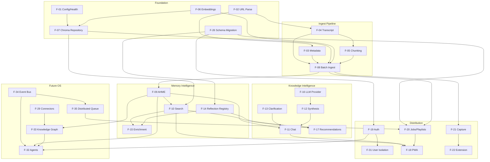

# MASTER SPEC — AI Memory Operating System

**Version:** 2.11  
**Status:** Single source of truth for production execution — **Version 1 track complete (V1-0 … V1-9)**  
**Last updated:** 2026-07-30  
**Repository:** `ai-memory-search-agent`

---

## 0. Document Purpose

This document inventories every feature in the repository, classifies implementation status, defines acceptance criteria, maps dependencies, and lays out a phased roadmap toward a production **AI Memory OS** (Jarvis-style: persistent memory, knowledge intelligence, autonomous agents, universal connectors).

**Rules for execution:**

1. Do not add speculative features without updating this document first.
2. Do not start new implementation until a feature is listed here with acceptance criteria.
3. Status changes require updating the **Feature Inventory** and relevant phase checklist.
4. Architecture-phase docs extend this spec — they do not override acceptance criteria here.

### 0.1 Architecture Document Index

| Document | Purpose |
|----------|---------|
| **`MASTER_SPEC.md`** (this file) | Execution inventory, phases, gaps, gates |
| **`JARVIS_VISION.md`** | Long-term UX north star |
| **`COMPETITOR_BIBLE.md`** | Market analysis and opportunities |
| **`FEATURE_IDEAS.md`** | Full backlog with priority / difficulty / value |
| **`KNOWLEDGE_ENGINE.md`** | AHME + planned intelligence engines |
| **`AGENT_BIBLE.md`** | Future agent catalog and orchestration |
| **`CONNECTOR_SDK.md`** | Universal ingestion architecture |
| **`docs/V1_PRODUCT_SPEC.md`** | V1 Chrome Extension product scope |
| **`docs/V1_PLATFORM_CAPABILITY_MATRIX.md`** | V1 readiness audit per capability |
| **`docs/V1_RELEASE_PLAN.md`** | V1-0 … V1-9 implementation phases |
| **`docs/V1_EXTENSION_ARCHITECTURE.md`** | Extension MV3 technical design |
| **`docs/V1_PRIVACY_MODEL.md`** | Privacy and data-flow disclosure |
| **`docs/V1_DEMO_SCRIPT.md`** | Store / LinkedIn demo script |
| **`docs/V1_5_MEMORY_WORKSPACE.md`** | AI Memory Workspace (PWA orchestration UI) |
| **`docs/V1_9_DEMO_STORE_LAUNCH.md`** | Final V1 milestone (demo / store / LinkedIn / CI) |

---

## 0.2 Product Philosophy

1. **Memory is user-owned** — exportable, self-hostable, auditable. No black-box “the AI remembers you.”
2. **Grounded or labeled** — answers cite evidence or declare low confidence; never fake certainty.
3. **Intent at capture** — *why* you saved something matters as much as *what* you saved.
4. **Progressive intelligence** — deterministic core always works; LLM and agents are optional layers.
5. **OS, not app** — connectors, jobs, agents, and memory share one platform abstraction.
6. **Calm UX** — proactive help without surveillance; explicit save beats ambient recording in core product.

---

## 0.3 Core Engineering Principles

| Principle | Meaning in this codebase |
|-----------|--------------------------|
| **Modular monolith first** | FastAPI + services + repos; split workers later, not prematurely |
| **Feature flags over forks** | AHME, auth, jobs, LLM controlled by `Settings` |
| **Fail open on retrieval** | AHME flat fallback; chat deterministic fallback |
| **Fail closed on security** | SSRF blocks, auth boundaries, agent write policies |
| **Test isolation** | Temp SQLite/Chroma per test; autouse singleton reset (`tests/conftest.py`) |
| **Lazy heavy imports** | sentence-transformers, chromadb loaded on demand |
| **Schema versioning** | SQLite `PRAGMA user_version`; index version invalidates cache |
| **Thin routes, fat services** | Routes validate + delegate; logic in `app/services/` |
| **No secrets in repo** | Keys via env (`AUTH_SECRET`, `YOUTUBE_API_KEY`, …) |
| **Document before build** | New capability → FEATURE_IDEAS + MASTER_SPEC update first |

---

## 0.4 Version 2.0 Ultimate Vision

**Jarvis OS** — a personal AI memory operating system where:

- **Universal capture** flows through a connector SDK (YouTube, web, Readwise, Drive, …).
- **Hierarchical memory** (capsules → sections → evidence) powers hybrid retrieval (AHME).
- **Knowledge engines** — verification, consensus, trust, gap detection, reverse memory, learning evolution — make memory trustworthy and actionable.
- **Agents** triage captures, run research, schedule review, and maintain the library under human policy.
- **One UX** — command bar, timeline, briefings, cited chat — across devices.
- **Production scale** — multi-tenant auth, distributed jobs, Postgres + managed vectors, event audit bus.

**Maturity today:** Ingest + AHME + chat + PWA + jobs + capture + **Brain layer (F-36–F-38, F-33 foundation)** are **Complete/Partial** on single-node. Agents, consensus/gap engines, connectors SDK, and scale-out remain **Planned**.

Full UX narrative: **`JARVIS_VISION.md`**.

---

## 0.5 Explicit Non-Goals

These are **out of scope** unless explicitly promoted via spec amendment:

| Non-goal | Rationale |
|----------|-----------|
| Team wiki / Notion replacement | Different collaboration model; we optimize personal memory |
| General-purpose note editor | Not an authoring tool; capture + retrieve first |
| Covert ambient lifelogging | Privacy backlash; conflicts with philosophy §0.2 |
| Social network / shared memories | Tenant isolation is hard enough without social graph |
| Training custom foundation models | We orchestrate retrieval + synthesis, not pretraining |
| Real-time collaborative editing | CRDT/sync complexity not justified for v1–v3 |
| Mobile-native apps (Phase 1–3) | PWA + extension sufficient until Jarvis Phase 5 |
| Consensus / Gap / multi-agent engines | **Frozen** during V1 — see §0.7 |
| Guaranteed LLM answer quality | Grounding yes; model quality depends on provider |
| Legal/medical/financial advice certification | User responsible; we cite, not certify |
| Replacing user's PKM entirely | Bridge/export to Obsidian et al. is a feature, not a fight |

---

## 0.6 Scalability Assumptions

Assumptions for production architecture decisions (see §6 Gaps):

| Dimension | Assumption (Year 1 prod) | Assumption (Jarvis scale) |
|-----------|--------------------------|---------------------------|
| Users | 1–1k self-host / small SaaS | 10k+ multi-tenant SaaS |
| Memories per user | 10²–10³ videos | 10⁴+ mixed sources |
| Chunks per user | 10⁴–10⁵ | 10⁶+ |
| Concurrent ingests | 3 (config) per node | Queue-backed, horizontal workers |
| Search latency p95 | < 2s single-node CPU | < 500ms with dedicated vector DB |
| Embedding | Local MiniLM on CPU | Optional GPU / embedding service |
| SQLite | OK for single-node demo | **Not** OK for multi-worker writes |
| Chroma | OK for self-host single node | Evaluate Qdrant/pgvector at scale |
| Job worker | In-process threads | Redis/SQS + worker pool |
| Auth | Demo + basic sessions | OAuth + RBAC + audit |
| Uptime target | Best effort self-host | 99.9% SaaS (Phase 5) |

**Scaling trigger points:**

1. **>1 uvicorn worker** → must fix GAP-01 (worker singleton) and GAP-02 (SQLite writer).  
2. **>500 concurrent users** → Postgres + distributed queue mandatory.  
3. **>1M chunks total** → dedicated vector tier + FTS partition strategy.

---

## 0.7 V1 Release Gate — AI Memory Agent (Chrome Extension)

**Effective:** 2026-07-28  
**Objective:** Ship a working Chrome extension + polished demo + GitHub + Chrome Web Store / LinkedIn launch.

### Frozen during V1

Do **not** implement unless explicitly promoted out of V1:

- Consensus Engine (N-01), Gap Engine (N-04), Reverse Memory (N-06), Learning Evolution (N-07)
- Autonomous multi-agent orchestration (A-01–A-07)
- Full Connector SDK marketplace (C-01)
- Jarvis-scale architecture work unrelated to extension UX

Brain foundation (F-36, F-37, F-38, F-33 partial) **remains** — extension consumes it.

### V1 execution phases

| Phase | Focus | Doc |
|-------|-------|-----|
| V1-0 | Release audit | `docs/V1_PLATFORM_CAPABILITY_MATRIX.md` ✅ |
| V1-1 | **AI Memory Agent Foundation** (observer + popup + instant save + health) | `docs/V1_1_IMPLEMENTATION.md` ✅ |
| V1-2 | **YouTube Memory Agent** (reference connector) | `docs/V1_2_YOUTUBE_AGENT.md` ✅ |
| V1-3 | **Memory Intelligence Layer** | `docs/V1_3_MEMORY_INTELLIGENCE.md` ✅ |
| V1-4 | **Universal Memory Connectors** (bookmarks, web, PDF, GitHub) | `docs/V1_4_UNIVERSAL_CONNECTORS.md` ✅ |
| V1-5 | **AI Memory Workspace** (dashboard, search, ask, imports, topics) | `docs/V1_5_MEMORY_WORKSPACE.md` ✅ |
| V1-6 | **Playlist / Watch Later polish** | `docs/V1_6_PLAYLIST_WATCH_LATER.md` ✅ |
| V1-7 | Agent command polish / store prep | `docs/V1_7_AGENT_COMMAND.md` ✅ |
| V1-8 | Auth, isolation, privacy | `docs/V1_PRIVACY_MODEL.md` · `docs/V1_8_AUTH_PRIVACY.md` ✅ |
| V1-9 | Demo, GitHub, store, LinkedIn | `docs/V1_9_DEMO_STORE_LAUNCH.md` ✅ |

### V1 ship criteria

1. Extension saves YouTube from current tab with acknowledgement + processing visibility  
2. Search + chat with citations work against saved library (PWA minimum; extension preferred)  
3. Playlist or bookmark import with user confirmation  
4. Trust/lifecycle demonstrable via API or UI  
5. Privacy model documented; no covert capture  
6. `pytest -q` green  
7. No feature marked **Complete** without code + passing tests  

### V1 readiness snapshot (2026-07-30, post V1-9 — **V1 track complete**)

| Area | Status |
|------|--------|
| Backend YouTube ingest/search/chat | **Complete** (YouTube reference connector) |
| Memory intelligence (topics/timeline/roadmap/insights) | **Complete for V1-3** |
| Universal connectors (web/pdf/github/bookmarks) | **Complete for V1-4** |
| AI Memory Workspace PWA | **Complete for V1-5** |
| Playlist import UX (preview → confirm → job) | **Complete for V1-6** |
| Chrome extension Agent UI | **Complete for V1-1** (+ Ask / Capture deep-links; bookmarks/PDF import) |
| Agent command / search-chat UX | **Complete for V1-7** (`POST /agent/command`; popup command bar; single-use bulk `confirm_token`) |
| Auth / isolation / privacy | **Complete for V1-8** (sessions, export/delete, rate limit, `/privacy`) |
| Watch Later OAuth | **Deferred** (documented public-playlist demo fallback; no scrape) |
| Demo / GitHub / store / LinkedIn / CI | **Complete for V1-9** (package ready to submit; live CWS upload + video recording are human steps) |

**Version 1 complete.** Do **not** start Version 2 / frozen engines without an explicit gate.

---

## 1. Vision & North Star

### 1.1 Product Definition

An **AI Memory Operating System** that:

- Captures knowledge from any connector (YouTube today; web, docs, chat, email tomorrow).
- Stores it in a **hierarchical memory model** (capsule → section → evidence) with vector + lexical indexes.
- Retrieves context with **intent-aware hybrid search** (AHME).
- Answers questions with **grounded synthesis** and citations.
- Learns user intent via **reflection metadata** and usage signals.
- Runs **background ingestion** at scale with resumable jobs.
- Eventually orchestrates **autonomous agents** that read/write memory safely.

### 1.2 Current Maturity

| Layer | Maturity |
|-------|----------|
| Ingest + flat vector search | Production-capable (single-node) |
| AHME hierarchical retrieval | Complete with feature flag + flat fallback |
| Distribution (PWA, jobs, capture) | Complete for local/demo deployment |
| Multi-user production auth | Partial |
| Agent / connector OS | Planned |
| **V1 Chrome extension UX** | **Partial** (see §0.7) |

**Test baseline:** `source .venv_clean/bin/activate && pytest -q` → **107 tests collected** (2026-07-28); brain subset **22 passed**; full-suite green required before V1 store submit.

**Launch command:**

```bash
source .venv_clean/bin/activate
JOBS_ENABLED=true AUTH_ENABLED=false PWA_ENABLED=true \
  uvicorn app.main:app --host 0.0.0.0 --port 8000
```

**Docker:**

```bash
docker compose up --build
```

---

## 2. Architecture Overview

### 2.1 Layered Design

```
┌─────────────────────────────────────────────────────────────┐
│  Clients: PWA (app/static) │ Streamlit │ Chrome Extension   │
└────────────────────────────┬────────────────────────────────┘
                             │ HTTP / JSON
┌────────────────────────────▼────────────────────────────────┐
│  FastAPI Routes (app/api/routes/*) — thin, auth-aware       │
└────────────────────────────┬────────────────────────────────┘
                             │ Depends()
┌────────────────────────────▼────────────────────────────────┐
│  Services (app/services/*) — business logic, orchestration  │
└────────────────────────────┬────────────────────────────────┘
                             │
        ┌────────────────────┼────────────────────┐
        ▼                    ▼                    ▼
  MemoryRepository    VideoRegistry / Stores   AHME Engine
        │                    │                    │
        └────────────────────┼────────────────────┘
                             ▼
              ChromaDB (vectors) + SQLite (metadata, FTS, jobs, auth)
```

### 2.2 Key Patterns

| Pattern | Location | Notes |
|---------|----------|-------|
| Settings singleton | `app/config.get_settings()` | `@lru_cache`; cleared in tests |
| Chroma client cache | `app/db/chroma_client.py` | Keyed by persist dir |
| Video registry cache | `app/db/video_registry.py` | Keyed by sqlite path |
| Embedding model | `app/core/embeddings.py` | Thread-safe lazy singleton |
| Job worker | `app/services/job_worker.py` | In-process daemon threads; lifespan-managed |
| Dependency injection | `app/api/dependencies.py`, `app/api/auth.py` | Overridden in tests via `app.dependency_overrides` |
| Schema versioning | `app/db/schema.py` | `PRAGMA user_version`; current **v3** |
| Feature flags | `Settings` | AHME, auth, jobs, LLM, PWA |

### 2.3 Data Stores

| Store | Technology | Purpose |
|-------|------------|---------|
| Vector chunks | Chroma `memory_items` | Transcript evidence embeddings |
| Vector capsules/sections | Chroma `memory_capsules`, `memory_sections` | AHME hierarchy |
| Video metadata + reflection | SQLite `video_registry`, `video_reflection` | Save intent, usage stats |
| Lexical index | SQLite FTS5 `memory_fts` | Hybrid retrieval |
| Semantic cache | SQLite `semantic_cache` | Query/answer cache |
| Jobs | SQLite `background_jobs`, `job_items`, `job_events` | Resumable playlist ingest |
| Auth | SQLite `users`, `sessions` | Sessions when `auth_enabled=true` |
| Captures | SQLite `captures`, `browser_bookmarks` | Extension / web capture |

---

## 3. Feature Inventory

Status legend: **Complete** | **Partial** | **Planned** | **Missing**

---

### F-01 — Application Configuration & Health

| Field | Detail |
|-------|--------|
| **Status** | **Complete** |
| **Purpose** | Central typed config; health probe for API + Chroma |
| **Architecture** | `Settings` (pydantic-settings) → `get_settings()` singleton |
| **Data model** | N/A (env-driven) |
| **API endpoints** | `GET /api/v1/health` |
| **UI components** | PWA offline banner uses health indirectly |
| **Background jobs** | None |
| **Tests** | `tests/test_health.py` |
| **Acceptance criteria** | Health returns 200 with Chroma connected; 503 when Chroma fails; settings injectable in tests |
| **Dependencies** | Chroma client, MemoryRepository |

---

### F-02 — YouTube URL Parsing & Validation

| Field | Detail |
|-------|--------|
| **Status** | **Complete** |
| **Purpose** | Normalize YouTube URLs; extract video IDs |
| **Architecture** | `app/utils/youtube_urls.py`, `app/utils/url_parser.py` |
| **Data model** | N/A |
| **API endpoints** | Used by ingest, capture, playlists (no standalone route) |
| **UI components** | Ingest URL fields in PWA + Streamlit |
| **Background jobs** | Used by job worker ingest |
| **Tests** | `tests/test_url_parser.py`, `tests/test_youtube_urls.py` |
| **Acceptance criteria** | Accepts watch, youtu.be, embed URLs; rejects invalid |
| **Dependencies** | None |

---

### F-03 — YouTube Metadata Fetch

| Field | Detail |
|-------|--------|
| **Status** | **Complete** |
| **Purpose** | Title, channel, thumbnail, duration via yt-dlp |
| **Architecture** | `MetadataService` |
| **Data model** | `VideoMetadata` (`app/models/video.py`) |
| **API endpoints** | Internal to ingest |
| **UI components** | Shown in search/chat result cards |
| **Background jobs** | Job worker |
| **Tests** | Mocked in ingest tests |
| **Acceptance criteria** | Returns metadata for valid public videos; timeout configurable |
| **Dependencies** | F-02, yt-dlp |

---

### F-04 — YouTube Transcript Fetch

| Field | Detail |
|-------|--------|
| **Status** | **Complete** |
| **Purpose** | Fetch timed transcript segments |
| **Architecture** | `TranscriptService`; in-process cache in `ingest_service` |
| **Data model** | `TranscriptResult`, `TranscriptSegment` |
| **API endpoints** | Internal to ingest |
| **UI components** | Timestamps in search/chat links |
| **Background jobs** | Job worker |
| **Tests** | `tests/test_transcript_service.py` |
| **Acceptance criteria** | Success path returns segments; empty/unavailable handled gracefully |
| **Dependencies** | F-02, youtube-transcript-api |

---

### F-05 — Transcript Chunking

| Field | Detail |
|-------|--------|
| **Status** | **Complete** |
| **Purpose** | Split transcripts into overlapping chunks with time bounds |
| **Architecture** | `app/utils/chunking.py` |
| **Data model** | Chunk dicts → `MemoryMetadata` |
| **API endpoints** | Internal |
| **UI components** | N/A |
| **Background jobs** | Job worker |
| **Tests** | `tests/test_chunking.py` |
| **Acceptance criteria** | Respects `chunk_size`, `chunk_overlap`; preserves start/end times |
| **Dependencies** | F-04 |

---

### F-06 — Embeddings

| Field | Detail |
|-------|--------|
| **Status** | **Complete** |
| **Purpose** | Vectorize text with Sentence Transformers |
| **Architecture** | `app/core/embeddings.py` — lazy singleton model |
| **Data model** | Float vectors stored in Chroma |
| **API endpoints** | Internal |
| **UI components** | N/A |
| **Background jobs** | Ingest, search, AHME, semantic cache |
| **Tests** | Mocked in most tests; real model in integration paths |
| **Acceptance criteria** | Batch embed; model name configurable; resettable in tests |
| **Dependencies** | sentence-transformers |

---

### F-07 — Chroma Memory Repository (Flat Index)

| Field | Detail |
|-------|--------|
| **Status** | **Complete** |
| **Purpose** | CRUD + semantic search over transcript chunks |
| **Architecture** | `MemoryRepository` → `chroma_client` |
| **Data model** | `MemoryMetadata`; doc IDs include `user_id` when set |
| **API endpoints** | Via search/ingest |
| **UI components** | Search results |
| **Background jobs** | Ingest worker |
| **Tests** | `tests/test_chroma_client.py`, `tests/test_search_service.py`, ingest tests |
| **Acceptance criteria** | Upsert, delete-by-video, search with score; connection check for health |
| **Dependencies** | F-06, ChromaDB |

---

### F-08 — Batch YouTube Ingest

| Field | Detail |
|-------|--------|
| **Status** | **Complete** |
| **Purpose** | End-to-end pipeline: metadata → transcript → capsule → chunk → embed → store |
| **Architecture** | `IngestService` — bounded concurrency, skip-if-indexed, force_refresh |
| **Data model** | `IngestRequest/Response`, `IngestResultItem` |
| **API endpoints** | `POST /api/v1/videos/ingest` (max 20 URLs) |
| **UI components** | PWA ingest panel; Streamlit ingest |
| **Background jobs** | Called by job worker, capture service |
| **Tests** | `tests/test_ingest_service.py`, `tests/test_async_ingest.py`, `tests/test_api_videos_search.py` |
| **Acceptance criteria** | Batch limit enforced; skip indexed; force refresh replaces chunks; reflection passed through; per-URL error isolation |
| **Dependencies** | F-02–F-07, F-09 (optional AHME), F-14 (reflection) |

---

### F-09 — Adaptive Hierarchical Memory Engine (AHME)

| Field | Detail |
|-------|--------|
| **Status** | **Complete** (single-node; flag `hierarchical_retrieval_enabled`) |
| **Purpose** | Capsule → section → evidence retrieval with RRF, MMR, FTS hybrid, semantic cache |
| **Architecture** | `AdaptiveHierarchicalMemoryEngine`, `HierarchicalStore`, `CapsuleService`, `FTSIndex`, `RRF`, `MMR`, `SemanticCache`, `QueryRouter`, `DeduplicationService` |
| **Data model** | `MemoryCapsule`, `MemorySection`, `StructuredAnswer`; SQLite `memory_capsules_json`, `memory_fts`, `semantic_cache`, hash tables |
| **API endpoints** | Used by `GET /api/v1/search`, `POST /api/v1/chat` (not separate route) |
| **UI components** | Debug metrics panel when `debug=true` |
| **Background jobs** | Capsule generation during ingest |
| **Tests** | `tests/test_ahme.py`, `scripts/benchmark_ahme.py` |
| **Acceptance criteria** | Hierarchical path narrows retrieval; flat fallback when flag off; cache invalidates on index version bump; benchmark script runs |
| **Dependencies** | F-06, F-07, F-05, SQLite schema v2+ |

---

### F-10 — Semantic Search API

| Field | Detail |
|-------|--------|
| **Status** | **Complete** |
| **Purpose** | Query memories; group by video; enrich results |
| **Architecture** | `SearchService` → AHME or flat repository |
| **Data model** | `SearchResponse`, `SearchResultItem` |
| **API endpoints** | `GET /api/v1/search?q=&limit=&debug=` |
| **UI components** | PWA search panel; Streamlit search |
| **Background jobs** | None |
| **Tests** | `tests/test_search_service.py`, `tests/test_api_videos_search.py`, `tests/test_enrichment_why_matched.py` |
| **Acceptance criteria** | Empty query rejected; limit validated; results include timestamp URLs, enrichment fields |
| **Dependencies** | F-07 or F-09, F-15, F-14 |

---

### F-11 — Grounded Chat API

| Field | Detail |
|-------|--------|
| **Status** | **Complete** |
| **Purpose** | Q&A over saved memories with sources and clarification |
| **Architecture** | `ChatService` → retrieve → clarify → synthesize → cite |
| **Data model** | `ChatRequest/Response`, `ChatSource`, `ClarificationOption` |
| **API endpoints** | `POST /api/v1/chat` |
| **UI components** | PWA chat panel; Streamlit chat |
| **Background jobs** | None |
| **Tests** | `tests/test_chat_service.py`, `tests/test_chat_api.py`, `tests/test_clarification_service.py`, `tests/test_answer_generator.py`, `tests/test_answer_synthesizer.py` |
| **Acceptance criteria** | Grounded answers cite sources; ambiguous queries offer clarification; validation on question/top_k |
| **Dependencies** | F-09 or F-10, F-12, F-13, F-16 |

---

### F-12 — Answer Generation & Synthesis

| Field | Detail |
|-------|--------|
| **Status** | **Complete** (deterministic); **Partial** (LLM path) |
| **Purpose** | Build structured answers from evidence chunks |
| **Architecture** | `DeterministicAnswerGenerator`, `AnswerSynthesizer`, `GroundedSynthesis` + optional `LLMProvider` |
| **Data model** | `StructuredAnswer` |
| **API endpoints** | Internal to chat |
| **UI components** | Chat answer rendering |
| **Background jobs** | None |
| **Tests** | `tests/test_answer_generator.py`, `tests/test_answer_synthesizer.py` |
| **Acceptance criteria** | Procedural/conceptual templates work without LLM; LLM optional via `llm_provider` |
| **Dependencies** | F-16 (optional) |

---

### F-13 — Query Clarification

| Field | Detail |
|-------|--------|
| **Status** | **Complete** |
| **Purpose** | Detect ambiguous queries; offer disambiguation options |
| **Architecture** | `ClarificationService` |
| **Data model** | `ClarificationOption` |
| **API endpoints** | Returned in chat response |
| **UI components** | PWA clarification chips |
| **Background jobs** | None |
| **Tests** | `tests/test_clarification_service.py` |
| **Acceptance criteria** | Wiring-related ambiguity produces options; selected option filters chunks |
| **Dependencies** | F-11 |

---

### F-14 — Memory Reflection & Usage Registry

| Field | Detail |
|-------|--------|
| **Status** | **Complete** |
| **Purpose** | Capture why user saved content; track views, searches, feedback |
| **Architecture** | `VideoRegistry` (SQLite) |
| **Data model** | `ReflectionInput/Display`, `UsageStats`, `FeedbackRequest` |
| **API endpoints** | `POST /api/v1/videos/{video_id}/view`, `POST .../feedback`; reflection via ingest body |
| **UI components** | PWA reflection form; view tracking on result open |
| **Background jobs** | None |
| **Tests** | `tests/test_reflection_registry.py`, `tests/test_async_ingest.py` |
| **Acceptance criteria** | Reflection persists; usage counters increment; feedback recorded |
| **Dependencies** | SQLite schema (video_registry tables) |

---

### F-15 — Result Enrichment

| Field | Detail |
|-------|--------|
| **Status** | **Complete** |
| **Purpose** | Add `one_line_memory`, `why_saved`, `action_items`, `why_matched` to search hits |
| **Architecture** | `EnrichmentService` |
| **Data model** | Fields on `SearchResultItem` |
| **API endpoints** | Via search |
| **UI components** | Search result cards |
| **Background jobs** | None |
| **Tests** | `tests/test_enrichment_service.py`, `tests/test_enrichment_why_matched.py` |
| **Acceptance criteria** | Enrichment fields populated when registry data exists |
| **Dependencies** | F-14, F-10 |

---

### F-16 — LLM Provider Integration

| Field | Detail |
|-------|--------|
| **Status** | **Partial** |
| **Purpose** | Optional Ollama / OpenAI-compatible synthesis and capsules |
| **Architecture** | `LLMProvider` — `none` (default), `ollama`, `openai_compatible` |
| **Data model** | N/A |
| **API endpoints** | None (internal) |
| **UI components** | N/A |
| **Background jobs** | None |
| **Tests** | Covered indirectly; no dedicated LLM integration tests |
| **Acceptance criteria** | When `llm_provider=none`, full pipeline works deterministically; LLM paths need integration tests before marking Complete |
| **Dependencies** | External LLM endpoint |

---

### F-17 — Preference-Aware Recommendations

| Field | Detail |
|-------|--------|
| **Status** | **Complete** |
| **Purpose** | Suggest related saved memories for a query |
| **Architecture** | `RecommendationService` |
| **Data model** | `RecommendationItem` |
| **API endpoints** | `GET /api/v1/videos/recommendations?q=&limit=` |
| **UI components** | Chat follow-up suggestions (partial wiring) |
| **Background jobs** | None |
| **Tests** | Indirect via distribution TestClient verification |
| **Acceptance criteria** | Returns list for valid query; respects limit |
| **Dependencies** | F-14, F-10 |

---

### F-18 — PWA Shell & Static Demo UI

| Field | Detail |
|-------|--------|
| **Status** | **Complete** |
| **Purpose** | Installable web app for ingest, search, chat, playlists, jobs |
| **Architecture** | `app/static/*`; routes in `app/main.py` |
| **Data model** | N/A |
| **API endpoints** | `GET /`, `/share`, `/manifest.webmanifest`, `/sw.js`, `/api/v1/pwa/config`, `/static/*` |
| **UI components** | `index.html`, `app.js`, `style.css`, icons |
| **Background jobs** | Polls job status from UI |
| **Tests** | `tests/test_distribution.py` |
| **Acceptance criteria** | Manifest + SW served; share target works; config endpoint exposes flags; offline shell cached (API network-first) |
| **Dependencies** | F-08, F-10, F-11, F-20, F-21 |

---

### F-19 — Authentication & Sessions

| Field | Detail |
|-------|--------|
| **Status** | **Complete for V1** (no OAuth / password reset / RBAC — deferred) |
| **Purpose** | Multi-user boundary; session tokens |
| **Architecture** | `AuthStore`, `get_current_user`; demo user when `auth_enabled=false` |
| **Data model** | `users`, `sessions`; `UserPublic`, `AuthResponse` |
| **API endpoints** | `GET /api/v1/auth/me`, `POST /auth/register`, `POST /auth/login`, `POST /auth/logout` |
| **UI components** | PWA assumes demo mode; extension uses manual Bearer token |
| **Background jobs** | None |
| **Tests** | `tests/test_v1_8_auth_privacy.py`, job isolation in `tests/test_distribution.py` |
| **Acceptance criteria** | Demo mode works without credentials; register/login disabled when auth off; logout revokes session |
| **Dependencies** | SQLite schema v3+, F-31 |

---

### F-20 — Background Jobs & Playlist Ingest

| Field | Detail |
|-------|--------|
| **Status** | **Complete** (single-process) |
| **Purpose** | Resumable playlist ingestion with pause/resume/retry/cancel |
| **Architecture** | `JobStore`, `JobWorker` (daemon threads), `PlaylistService`, `PlaylistResolver` |
| **Data model** | `background_jobs`, `job_items`, `job_events`; `BackgroundJob`, `JobDetailResponse` |
| **API endpoints** | `POST /api/v1/playlists/preview`, `POST /playlists/ingest`, `GET/POST /api/v1/jobs/{id}` (pause/resume/retry-failed/cancel), `DELETE /api/v1/jobs/{id}` |
| **UI components** | PWA Capture playlist panel (preview→confirm→progress) |
| **Background jobs** | **Core feature** — in-process worker |
| **Tests** | `tests/test_distribution.py`, `tests/test_playlists_v1_6.py` |
| **Acceptance criteria** | Job created with items; pause/resume; retry failed; soft cancel; user-scoped; WL/`list=WL` rejected; worker starts when `jobs_enabled=true` |
| **Dependencies** | F-08, F-02, schema v3 |

---

### F-21 — Content Capture & SSRF-Safe Fetch

| Field | Detail |
|-------|--------|
| **Status** | **Complete** |
| **Purpose** | Capture URLs from Agent extension; YouTube → async ingest; articles → lightweight store |
| **Architecture** | `CaptureService` (async YouTube stages), `ssrf_fetch.py`, `AgentStatusService` |
| **Data model** | `captures` (+ stage/stage_detail), `agent_search_events` (schema v5) |
| **API endpoints** | `POST /capture/url`, `/batch`, `GET /capture/status/{id}`, `POST /capture/retry/{id}`, `POST /capture/bookmarks/import`, `GET /agent/status` |
| **UI components** | Agent popup pipeline |
| **Background jobs** | Daemon thread per YouTube save |
| **Tests** | `tests/test_distribution.py`, `tests/test_agent_api.py` |
| **Acceptance criteria** | Blocks private IPs; YouTube save returns queued immediately; status polls to completed/failed; retry works |
| **Dependencies** | F-08, F-19 |

---

### F-22 — Chrome Extension (MV3) / AI Memory Agent UI

| Field | Detail |
|-------|--------|
| **Status** | **Complete** (V1-1 foundation) |
| **Purpose** | Observe current page, add to Memory, ask Memory — assistant UX |
| **Architecture** | `extension/` — Context Observer content script, module service worker, Agent popup, settings |
| **Data model** | Session-only temp context; uses capture + agent status APIs |
| **API endpoints** | Client of F-21 + `GET /api/v1/agent/status` |
| **UI components** | Observing card, pipeline stages, health, memory status, permissions, settings |
| **Background jobs** | Async capture processing on backend |
| **Tests** | `tests/test_agent_api.py`, `tests/test_extension_context.py` |
| **Acceptance criteria** | Open YouTube → see observation → Save → live stages → completed; pause/clear context; no URL copy |
| **Dependencies** | F-21, F-19 |

---

### F-23 — Bookmark Import

| Field | Detail |
|-------|--------|
| **Status** | **Partial** |
| **Purpose** | Import browser bookmarks into capture pipeline |
| **Architecture** | `CaptureService.capture_bookmarks` → `browser_bookmarks` table |
| **Data model** | `browser_bookmarks` |
| **API endpoints** | `POST /api/v1/capture/bookmarks/import` |
| **UI components** | None dedicated |
| **Background jobs** | None (batch in request) |
| **Tests** | None dedicated |
| **Acceptance criteria** | API accepts bookmark list; **Gap:** no sync UX, no scheduled re-import |
| **Dependencies** | F-21 |

---

### F-24 — Streamlit Frontend

| Field | Detail |
|-------|--------|
| **Status** | **Complete** (legacy/alternate UI) |
| **Purpose** | HTTP client for ingest, search, chat |
| **Architecture** | `frontend/streamlit_app.py` → FastAPI |
| **Data model** | N/A |
| **API endpoints** | Client of F-08, F-10, F-11 |
| **UI components** | Streamlit widgets |
| **Background jobs** | None |
| **Tests** | `tests/test_streamlit_helpers.py` |
| **Acceptance criteria** | Parses ingest responses; formats HTTP errors |
| **Dependencies** | Running FastAPI |

---

### F-25 — Docker Deployment

| Field | Detail |
|-------|--------|
| **Status** | **Complete** |
| **Purpose** | Containerized single-node deployment |
| **Architecture** | `Dockerfile`, `docker-compose.yml`; volume `/app/data` |
| **Data model** | Persistent Chroma + SQLite in volume |
| **API endpoints** | All (port 8000) |
| **UI components** | PWA served from container |
| **Background jobs** | Worker in same container |
| **Tests** | None (manual) |
| **Acceptance criteria** | Image builds; healthcheck passes; data survives restart via volume |
| **Dependencies** | All core features |

---

### F-26 — Schema Migration System

| Field | Detail |
|-------|--------|
| **Status** | **Complete** |
| **Purpose** | Versioned SQLite migrations; index version for cache invalidation |
| **Architecture** | `app/db/schema.py` — v1→v2→v3 |
| **Data model** | `app_meta.memory_index_version`, `preference_version` |
| **API endpoints** | Runs on app lifespan |
| **UI components** | N/A |
| **Background jobs** | None |
| **Tests** | `tests/test_ahme.py` (migration), distribution tests |
| **Acceptance criteria** | Idempotent migrate; v3 adds auth/jobs/capture tables |
| **Dependencies** | SQLite |

---

### F-27 — Benchmark & Import Diagnostics

| Field | Detail |
|-------|--------|
| **Status** | **Partial** |
| **Purpose** | Compare flat vs AHME; diagnose slow imports |
| **Architecture** | `scripts/benchmark_ahme.py`, `scripts/trace_imports.py` |
| **Data model** | `docs/BENCHMARK_AHME.md` output |
| **API endpoints** | N/A |
| **UI components** | N/A |
| **Background jobs** | N/A |
| **Tests** | N/A |
| **Acceptance criteria** | Benchmark script produces report; **Gap:** not in CI |
| **Dependencies** | F-09 |

---

### F-28 — CLI Utilities

| Field | Detail |
|-------|--------|
| **Status** | **Partial** |
| **Purpose** | Operator scripts for ingest and DB reset |
| **Architecture** | `scripts/ingest_item.py`, `scripts/reset_db.py` |
| **Data model** | N/A |
| **API endpoints** | N/A |
| **UI components** | N/A |
| **Background jobs** | N/A |
| **Tests** | N/A |
| **Acceptance criteria** | **Missing:** both scripts are TODO stubs |
| **Dependencies** | F-08, F-07 |

---

### F-29 — Pluggable Source Framework

| Field | Detail |
|-------|--------|
| **Status** | **Planned** |
| **Purpose** | Universal connectors (Notion, PDF, Slack, etc.) |
| **Architecture** | `app/services/sources/base_source.py`, `youtube_source.py` — **stubs only** |
| **Data model** | `SourceType` enum exists |
| **API endpoints** | None |
| **UI components** | None |
| **Background jobs** | None |
| **Tests** | None |
| **Acceptance criteria** | Not started — see Phase 5 roadmap |
| **Dependencies** | F-32, connector registry (Missing) |

---

### F-30 — SQLite Registry Client

| Field | Detail |
|-------|--------|
| **Status** | **Planned** |
| **Purpose** | List/delete items without scanning Chroma |
| **Architecture** | `app/db/sqlite_client.py` — **TODO stub** |
| **Data model** | Would mirror registry |
| **API endpoints** | None |
| **UI components** | None |
| **Background jobs** | None |
| **Tests** | None |
| **Acceptance criteria** | Stub only; VideoRegistry partially covers this |
| **Dependencies** | F-14 |

---

### F-31 — User Isolation (Multi-Tenant Memory)

| Field | Detail |
|-------|--------|
| **Status** | **Complete for V1** (legacy chunks without `user_id` still visible only to `local-default`) |
| **Purpose** | Scope Chroma docs and registry rows by `user_id` |
| **Architecture** | `MemoryRepository`, `VideoRegistry` composite PK, ingest/search/chat pass `user_id` |
| **Data model** | `user_id` on chunks metadata; registry `(user_id, video_id)` PK (schema v9) |
| **API endpoints** | All authenticated routes |
| **UI components** | Demo user `local-default` |
| **Background jobs** | Jobs scoped by user |
| **Tests** | `tests/test_distribution.py::TestUserIsolation`, `tests/test_v1_8_auth_privacy.py` |
| **Acceptance criteria** | Jobs/memories not visible cross-user; composite registry keys |
| **Dependencies** | F-19 |

---

### F-32 — Agent System

| Field | Detail |
|-------|--------|
| **Status** | **Missing** |
| **Purpose** | Autonomous agents that plan, act, and write memory safely |
| **Architecture** | Not implemented |
| **Data model** | N/A |
| **API endpoints** | N/A |
| **UI components** | N/A |
| **Background jobs** | N/A |
| **Tests** | N/A |
| **Acceptance criteria** | See Phase 4 roadmap |
| **Dependencies** | F-09, F-19, F-33, F-34 |

---

### F-33 — Knowledge Graph & Entity Intelligence

| Field | Detail |
|-------|--------|
| **Status** | **Partial** (foundation complete; temporal reasoning planned) |
| **Purpose** | Entity linking across memories; graph traversal for engines/agents |
| **Architecture** | `KnowledgeGraphStore`, `KnowledgeGraphService`; SQLite `kg_*` tables (schema v4) |
| **Data model** | `GraphEntity`, `GraphRelation`, `MemoryEntityLink` — types: memory, concept, person, company, project, technology, creator, tag |
| **API endpoints** | `GET /api/v1/knowledge/entities`, `/entities/{id}`, `/entities/{id}/relations`, `/graph/neighbors`, `/memories/{memory_id}/entities` |
| **UI components** | None yet |
| **Background jobs** | Entity extraction on ingest via `UniversalMemoryService.finalize_ingest` |
| **Tests** | `tests/test_knowledge_graph.py`, `tests/test_brain_api.py` |
| **Acceptance criteria** | [x] Entities/relations persisted per user; [x] Memory linked on ingest; [x] Search + neighbor APIs; [ ] Temporal facts; [ ] Cross-source entity merge UI |
| **Dependencies** | F-36, F-09, schema v4 |

---

### F-36 — Universal Memory Schema

| Field | Detail |
|-------|--------|
| **Status** | **Complete** |
| **Purpose** | Normalized memory object for every connector/source |
| **Architecture** | `UniversalMemory` model; `MemoryStore` (SQLite `memory_records`, `memory_versions`, `memory_trust_history`) |
| **Data model** | metadata, provenance, embedding refs, trust snapshot, relationship summary, content/schema version |
| **API endpoints** | `GET /api/v1/memories/by-external`, `GET /api/v1/memories/{id}` |
| **UI components** | None yet |
| **Background jobs** | Written on every ingest via `UniversalMemoryService` |
| **Tests** | `tests/test_universal_memory.py`, `tests/test_universal_memory_service.py`, `tests/test_universal_memory.py::TestSchemaV4` |
| **Acceptance criteria** | Upsert by `(user_id, source_type, external_id)`; version history on content change; trust history append |
| **Dependencies** | schema v4 |

---

### F-37 — Memory Lifecycle Engine

| Field | Detail |
|-------|--------|
| **Status** | **Complete** |
| **Purpose** | State machine: Captured → … → Trusted; archive/revive/merge |
| **Architecture** | `MemoryLifecycleService`; audit in `memory_lifecycle_events` |
| **Data model** | `MemoryLifecycleState`, `LifecycleTransition`, `INGEST_PIPELINE` |
| **API endpoints** | `GET /memories/{id}/lifecycle`, `POST /memories/{id}/archive`, `POST /memories/{id}/revive` |
| **UI components** | None yet |
| **Background jobs** | Pipeline advanced during ingest |
| **Tests** | `tests/test_memory_lifecycle.py`, `tests/test_brain_api.py` |
| **Acceptance criteria** | All 10 states supported; invalid transitions rejected; every transition timestamped in audit table |
| **Dependencies** | F-36 |

---

### F-38 — Trust Engine Foundation

| Field | Detail |
|-------|--------|
| **Status** | **Complete** (foundation scoring; feedback hooks ready) |
| **Purpose** | Persist trust metrics: source reliability, freshness, verification, evidence strength, confidence |
| **Architecture** | `TrustEngine` — weighted composite + tier; history in `memory_trust_history` |
| **Data model** | `TrustMetrics`, `TrustTier`, `VerificationStatus` |
| **API endpoints** | `GET /api/v1/memories/{id}/trust` |
| **UI components** | None yet (U-06 planned) |
| **Background jobs** | Computed at end of ingest pipeline |
| **Tests** | `tests/test_universal_memory.py::TestTrustEngine`, `tests/test_brain_api.py` |
| **Acceptance criteria** | Scores 0–1; tier derived; disputed caps overall; persisted on memory + history |
| **Dependencies** | F-36, F-37 |

---

### F-34 — Event Bus & Observability

| Field | Detail |
|-------|--------|
| **Status** | **Missing** |
| **Purpose** | Async domain events, metrics, tracing, audit log |
| **Architecture** | Not implemented |
| **Data model** | N/A |
| **API endpoints** | N/A |
| **UI components** | Debug metrics only (search) |
| **Background jobs** | N/A |
| **Tests** | N/A |
| **Acceptance criteria** | See Phase 1 production hardening |
| **Dependencies** | None (foundation for scale) |

---

### F-35 — Distributed Job Queue

| Field | Detail |
|-------|--------|
| **Status** | **Missing** |
| **Purpose** | Horizontally scalable background processing |
| **Architecture** | Today: in-process `JobWorker` only |
| **Data model** | SQLite queue (single writer) |
| **API endpoints** | Same job API |
| **UI components** | Same |
| **Background jobs** | **Blocked for multi-worker** |
| **Tests** | Single-node only |
| **Acceptance criteria** | See architectural gaps §6 |
| **Dependencies** | F-20, F-34 |

---

## 4. Status Summary

| Status | Count | Features |
|--------|-------|----------|
| **Complete** | 28 | F-01–F-11, F-13–F-15, F-17–F-21, F-24–F-26, F-31, **F-36–F-38** |
| **Partial** | 7 | F-12, F-16, F-22, F-23, F-27, F-28, **F-33** |
| **Planned** | 2 | F-29, F-30 |
| **Missing** | 3 | F-32, F-34, F-35 |

---

## 5. Dependency Graph

### 5.1 Feature Dependencies (Mermaid)



### 5.2 Implementation Order (Production Hardening First)

```
1. F-26 Schema → F-01 Config → F-06 Embeddings → F-07 Chroma
2. F-02 → F-03 → F-04 → F-05 → F-08 Ingest
3. F-14 Reflection → F-09 AHME → F-10 Search → F-15 Enrichment
4. F-12 → F-13 → F-11 Chat → F-17 Recommendations
5. F-19 Auth → F-31 User Isolation (complete gaps)
6. F-20 Jobs → F-21 Capture → F-18 PWA → F-22 Extension
7. F-34 Event Bus → F-35 Distributed Queue
8. F-29 Connectors → F-33 Knowledge Graph
9. F-32 Agent System → Jarvis OS
```

---

## 6. Architectural Gaps (Jarvis OS Scale)

### GAP-01 — Single-Node Process Model

| | |
|---|---|
| **Problem** | Global singletons (`get_settings`, Chroma cache, embedding model, `_WORKER`) assume one process. Multi-worker uvicorn or horizontal scaling causes duplicate workers, split brain, and Chroma write contention. |
| **Impact** | Cannot scale ingest or API beyond one container with 1 worker. |
| **Proposed change** | Extract stateless API tier; move job processing to dedicated worker service; externalize queue (Redis + RQ/Celery or Postgres LISTEN/NOTIFY). |
| **Migration plan** | Phase 1: Add `WORKER_MODE=api|worker|all` env flag; run worker only in worker containers. Phase 2: Replace SQLite job queue with Redis stream. Phase 3: Chroma → managed vector DB (Qdrant/Pinecone/pgvector) with tenant namespaces. |

### GAP-02 — SQLite as System of Record

| | |
|---|---|
| **Problem** | Auth, jobs, registry, FTS, cache in one SQLite file — single-writer bottleneck; no HA. |
| **Impact** | Job throughput, concurrent captures, and multi-tenant load capped. |
| **Proposed change** | Split stores: Postgres for relational (users, jobs, registry, FTS); keep Chroma or migrate vectors. |
| **Migration plan** | Phase 1: SQLAlchemy + Alembic alongside raw sqlite3; dual-write adapter. Phase 2: Cutover per table with export/import scripts. Phase 3: Retire SQLite in production profile. |

### GAP-03 — Incomplete Multi-Tenancy

| | |
|---|---|
| **Problem** | `video_registry` PK is `video_id` not `(user_id, video_id)`; legacy Chroma chunks lack `user_id`. |
| **Impact** | Data leakage risk under real auth; ambiguous ownership. |
| **Proposed change** | Schema v4: composite keys; migration backfill `user_id=local-default`; Chroma re-index with namespaced collections per tenant or mandatory metadata filter. |
| **Migration plan** | Phase 1: Add migration + enforcement in repository. Phase 2: Background re-index job. Phase 3: Reject reads without user_id filter. |

### GAP-04 — No Event / Audit Layer

| | |
|---|---|
| **Problem** | Services call each other synchronously; no audit trail for agent actions. |
| **Impact** | Agents cannot subscribe to memory changes; no compliance replay. |
| **Proposed change** | Introduce `MemoryEvent` bus (in-proc pub/sub → Redis/NATS); emit on ingest, delete, search, chat, job state change. |
| **Migration plan** | Phase 1: `EventEmitter` interface + SQLite `events` table. Phase 2: Webhook subscriptions. Phase 3: Agent trigger rules. |

### GAP-05 — Connector Framework Not Implemented

| | |
|---|---|
| **Problem** | `BaseSource` and `youtube_source` are stubs; all logic hard-coded in ingest/capture. |
| **Impact** | Every new source requires core service edits — not OS-like. |
| **Proposed change** | Plugin registry: `SourceConnector` protocol with `fetch`, `normalize`, `source_type`; register via entry points or config. |
| **Migration plan** | Phase 1: Refactor YouTube into first connector. Phase 2: Web article connector (from capture). Phase 3: OAuth connectors (Google Drive, Notion). |

### GAP-06 — LLM Integration Untested in Production

| | |
|---|---|
| **Problem** | Default `llm_provider=none`; no integration tests for Ollama/OpenAI paths. |
| **Impact** | Quality ceiling on synthesis; agent reasoning unavailable. |
| **Proposed change** | Contract tests with mocked LLM; observability for token usage; fallback always available. |
| **Migration plan** | Phase 2: Add `tests/test_llm_provider.py` + feature flag rollout. |

### GAP-07 — No API Rate Limiting / Quotas

| | |
|---|---|
| **Problem** | Public endpoints unguarded; ingest/capture can exhaust CPU/network. |
| **Impact** | DoS risk; runaway costs on embeddings. |
| **Status** | **Mitigated for V1** — `RateLimitMiddleware` (in-process); per-tenant quotas deferred to Postgres profile. |
| **Proposed change** | Middleware: per-user rate limits; ingest queue depth caps; capture size limits (partially exists). |
| **Migration plan** | Phase 1 ✅: custom middleware + 429 responses. Phase 2: Per-tenant quotas in Postgres. |

### GAP-08 — Cold Start / Import Latency

| | |
|---|---|
| **Problem** | First `app.main` import loads sentence-transformers (~minutes); blocks uvicorn startup. |
| **Impact** | Poor ops experience; flaky health checks during deploy. |
| **Proposed change** | Lazy route registration; pre-bake model in Docker image; optional remote embedding API. |
| **Migration plan** | Phase 1: Warmup endpoint + readiness vs liveness probes. Phase 2: Embedding microservice. |

### GAP-09 — Test / Ops Tooling Gaps

| | |
|---|---|
| **Problem** | Extension untested; CLI stubs; benchmark not in CI; README outdated. |
| **Impact** | Drift between docs and reality; manual verification burden. |
| **Proposed change** | Update README → point to MASTER_SPEC; implement `reset_db.py`; CI runs `pytest -q` + benchmark smoke. |
| **Migration plan** | Phase 1 foundation sprint (documentation + ops scripts only). |

---

## 7. Roadmap

### Phase 1 — Foundation (Production Hardening)

**Goal:** Trustworthy single-tenant deployment; ops-ready; no new user-facing features.

| Item | Features / Gaps | Deliverables |
|------|-----------------|--------------|
| Documentation sync | GAP-09 | Update README; this MASTER_SPEC as canonical |
| Ops CLI | F-28 | Implement `reset_db.py`, `ingest_item.py` |
| Auth hardening | F-19, GAP-03 | Composite registry keys; auth integration tests |
| User isolation completion | F-31 | Re-index migration; strict metadata filters |
| Observability baseline | GAP-04 (partial) | Structured logging; request IDs; metrics endpoint |
| Deploy reliability | GAP-08 | Docker warmup; liveness/readiness split |
| CI gate | F-27 | `pytest -q` in CI; optional benchmark job |

**Exit criteria:** Single-node production deploy with auth optional; 85+ tests green; documented runbook.

---

### Phase 2 — Memory Intelligence

**Goal:** Best-in-class retrieval and grounded answers.

| Item | Features | Deliverables |
|------|----------|--------------|
| LLM production path | F-16, GAP-06 | Integration tests; configurable provider; grounding validation |
| AHME tuning | F-09 | Benchmark in CI; default params from `BENCHMARK_AHME.md` |
| Semantic cache ops | F-09 | TTL metrics; manual invalidation API |
| Enrichment quality | F-15 | Reflection-aware ranking signals |
| Search UX | F-10, F-18 | Filters (channel, date, save reason); debug off by default in prod |

**Exit criteria:** Chat grounded rate measurable; search latency p95 documented; LLM path tested.

---

### Phase 3 — Knowledge Intelligence

**Goal:** Cross-source understanding beyond flat video transcripts.

| Item | Features | Deliverables |
|------|----------|--------------|
| Connector framework | F-29, GAP-05 | `BaseSource` implemented; YouTube + web connectors |
| Entity extraction | F-33 | Entity table; link entities across captures |
| Temporal memory | F-33 | Valid-from/to on facts; "what did I know at T?" query |
| Knowledge graph API | F-33 | `GET /api/v1/knowledge/entities`, `/relations` |
| Bookmark pipeline | F-23 | Scheduled import job; dedup against existing memory |

**Exit criteria:** Two non-YouTube sources ingested; entity search returns linked memories.

---

### Phase 4 — Agent System

**Goal:** Safe autonomous agents reading/writing memory.

| Item | Features | Deliverables |
|------|----------|--------------|
| Event bus | F-34, GAP-04 | Domain events; webhook subscriptions |
| Agent runtime | F-32 | `AgentExecutor` with tool registry |
| Memory tools | F-32 | `search_memory`, `ingest_url`, `reflect`, `schedule_job` |
| Policy engine | F-32 | Allow/deny lists; human-in-the-loop for writes |
| Agent API | F-32 | `POST /api/v1/agents/run`, `GET /agents/{run_id}` |

**Exit criteria:** Agent completes multi-step task with audit log; no unauthorized writes.

---

### Phase 5 — Jarvis OS

**Goal:** Universal memory operating system with connectors, agents, and unified UX.

| Item | Features | Deliverables |
|------|----------|--------------|
| Distributed queue | F-35, GAP-01 | Redis-backed workers; horizontal scale |
| Postgres cutover | GAP-02 | Production DB migration |
| Universal connectors | F-29 | OAuth connector SDK; marketplace config |
| Multi-platform UI | F-18 + new | Desktop shell (Tauri/Electron) or mobile PWA polish |
| Voice / proactive | New (spec first) | Wake word, scheduled briefings — **requires new MASTER_SPEC entry before build** |
| Jarvis orchestrator | F-32 + F-33 | Long-horizon planner across memory + external tools |

**Exit criteria:** Multi-tenant SaaS profile; 3+ connectors; agent fleet with isolation; 99.9% API availability target.

---

## 8. API Reference (Complete Surface)

| Method | Path | Feature |
|--------|------|---------|
| GET | `/` | F-18 |
| GET | `/share` | F-18 |
| GET | `/manifest.webmanifest` | F-18 |
| GET | `/sw.js` | F-18 |
| GET | `/static/*` | F-18 |
| GET | `/api/v1/pwa/config` | F-18 |
| GET | `/api/v1/health` | F-01 |
| GET | `/api/v1/auth/me` | F-19 |
| POST | `/api/v1/auth/register` | F-19 |
| POST | `/api/v1/auth/login` | F-19 |
| POST | `/api/v1/auth/logout` | F-19 / V1-8 |
| DELETE | `/api/v1/memories/{memory_id}` | V1-8 |
| GET | `/api/v1/privacy/export` | V1-8 |
| DELETE | `/api/v1/privacy/memories` | V1-8 |
| GET | `/privacy` | V1-8 |
| POST | `/api/v1/videos/ingest` | F-08 |
| GET | `/api/v1/videos/recommendations` | F-17 |
| POST | `/api/v1/videos/{video_id}/view` | F-14 |
| POST | `/api/v1/videos/{video_id}/feedback` | F-14 |
| POST | `/api/v1/playlists/preview` | F-20 |
| POST | `/api/v1/playlists/ingest` | F-20 |
| GET | `/api/v1/jobs/{job_id}` | F-20 |
| POST | `/api/v1/jobs/{job_id}/pause` | F-20 |
| POST | `/api/v1/jobs/{job_id}/resume` | F-20 |
| POST | `/api/v1/jobs/{job_id}/retry-failed` | F-20 |
| POST | `/api/v1/jobs/{job_id}/cancel` | F-20 |
| DELETE | `/api/v1/jobs/{job_id}` | F-20 |
| POST | `/api/v1/capture/url` | F-21 |
| POST | `/api/v1/capture/batch` | F-21 |
| GET | `/api/v1/capture/status/{capture_id}` | F-21 |
| POST | `/api/v1/capture/retry/{capture_id}` | F-21 / V1-1 |
| GET | `/api/v1/agent/status` | V1-1 |
| POST | `/api/v1/agent/command` | V1-7 |
| POST | `/api/v1/agent/command/execute` | V1-7 |
| POST | `/api/v1/capture/bookmarks/import` | F-23 |
| GET | `/api/v1/search` | F-10 |
| POST | `/api/v1/chat` | F-11 |
| GET | `/api/v1/memories/by-external` | F-36 |
| GET | `/api/v1/memories/{memory_id}` | F-36 |
| GET | `/api/v1/memories/{memory_id}/lifecycle` | F-37 |
| GET | `/api/v1/memories/{memory_id}/trust` | F-38 |
| POST | `/api/v1/memories/{memory_id}/archive` | F-37 |
| POST | `/api/v1/memories/{memory_id}/revive` | F-37 |
| GET | `/api/v1/knowledge/entities` | F-33 |
| GET | `/api/v1/knowledge/entities/{entity_id}` | F-33 |
| GET | `/api/v1/knowledge/entities/{entity_id}/relations` | F-33 |
| GET | `/api/v1/knowledge/graph/neighbors` | F-33 |
| GET | `/api/v1/knowledge/memories/{memory_id}/entities` | F-33 |

---

## 9. Configuration Reference

See `app/config.py` and `.env.example`. Critical production flags:

| Flag | Default | Production note |
|------|---------|-----------------|
| `auth_enabled` | `false` | Set `true` for multi-user |
| `rate_limit_enabled` | `true` | Per-IP API throttling (V1-8) |
| `rate_limit_requests` | `120` | Requests per window |
| `rate_limit_window_sec` | `60` | Window length |
| `jobs_enabled` | `true` | Disable in API-only containers when GAP-01 addressed |
| `hierarchical_retrieval_enabled` | `true` | Disable for debugging flat path |
| `llm_provider` | `none` | Set when Phase 2 LLM path validated |
| `semantic_cache_enabled` | `true` | Monitor staleness |
| `local_demo_mode` | `true` | Set `false` in hosted deployments |

---

## 10. Test Matrix

| Area | Test files | Count contribution |
|------|------------|-------------------|
| Core ingest/search | `test_ingest_service`, `test_search_service`, `test_async_ingest` | ~15 |
| AHME | `test_ahme` | ~20 |
| Chat/answers | `test_chat_*`, `test_answer_*`, `test_clarification_*` | ~15 |
| API validation | `test_api_videos_search`, `test_chat_api`, `test_health` | ~10 |
| Distribution | `test_distribution` | ~10 |
| **Brain / Phase 2** | `test_universal_memory`, `test_memory_lifecycle`, `test_knowledge_graph`, `test_universal_memory_service`, `test_brain_api` | ~25 |
| Utilities | `test_chunking`, `test_url_parser`, `test_youtube_urls`, `test_chroma_client`, `test_transcript_service` | ~15 |
| **Total** | 28 modules | **~110** |

**Required gate for any release:** `pytest -q` all green in `.venv_clean` (Python 3.11).

---

## 11. Change Log

| Date | Version | Change |
|------|---------|--------|
| 2026-07-18 | 1.0 | Initial MASTER_SPEC from repository inventory; 35 features classified; roadmap Phases 1–5; 9 architectural gaps documented |
| 2026-07-18 | 2.0 | Architecture phase: product philosophy, engineering principles, ultimate vision, non-goals, scalability assumptions; linked COMPETITOR_BIBLE, FEATURE_IDEAS, KNOWLEDGE_ENGINE, AGENT_BIBLE, CONNECTOR_SDK, JARVIS_VISION |
| 2026-07-21 | 2.1 | Phase 2 Brain: schema v4, universal memory, lifecycle, knowledge graph foundation, trust engine; F-36/F-37/F-38 complete; F-33 partial |
| 2026-07-28 | 2.2 | **V1 release gate:** Chrome extension ship track; audit docs in `docs/V1_*`; frozen Memory OS engines; test baseline 107 collected |
| 2026-07-28 | 2.3 | **V1-1 complete:** Agent popup, Context Observer, async capture stages, `GET /agent/status`, schema v5, extension rewrite |
| 2026-07-28 | 2.4 | **V1-2 complete:** YouTube reference connector, `YouTubeMemory`, schema v6, pipeline stages, search filters/explanation, related/duplicates, retry/diagnostics |
| 2026-07-28 | 2.5 | **V1-3 complete:** Memory Intelligence Layer — natural retrieve + explainability, topics, timeline, learning graph, roadmap, concept capsules, creator intel, insights; schema v7 |
| 2026-07-28 | 2.6 | **V1-4 complete:** Universal connectors (web/pdf/github/bookmarks), ConnectorIngestService, ImportManager, cross-dupe index, schema v8 |
| 2026-07-29 | 2.7 | **V1-5 complete:** AI Memory Workspace PWA (dashboard, universal search, ask, timeline, topics, imports, settings) over existing APIs |
| 2026-07-29 | 2.7.1 | **V1-5 audit remediation:** safeHref, cache invalidation, route abort/dispose, cooperative import cancel, PDF magic validation, render caps, behavioral tests |
| 2026-07-29 | 2.8 | **V1-6 complete:** Playlist preview→confirm→job UX; extension bookmarks/PDF; Watch Later documented fallback (no scrape); `docs/V1_6_PLAYLIST_WATCH_LATER.md` |
| 2026-07-29 | 2.8.1 | **V1-6 audit remediation:** job soft-cancel; atomic claim; WL/LL reject; playlist max; a11y progressbar; extension deep-link hardening; docs/tests |
| 2026-07-29 | 2.9 | **V1-7 complete:** Agent command bar + `/api/v1/agent/command`; bulk confirm_token gate; store listing draft; `docs/V1_7_AGENT_COMMAND.md` |
| 2026-07-29 | 2.9.1 | **V1-7 audit remediation:** single-use confirm tokens; non-forgeable local secret; execute no re-issue; extension in-flight guard; deep-link decode safety; docs/tests |
| 2026-07-30 | 2.10 | **V1-8 complete:** Auth logout; schema v9 registry tenant keys; export/delete APIs; rate limiting; `/privacy` page; `docs/V1_8_AUTH_PRIVACY.md` |
| 2026-07-30 | 2.11 | **V1-9 complete / V1 track done:** Demo script + seed; README polish; CWS listing package + assets; LinkedIn notes; CI pytest; SECURITY.md; VERSION 1.9.0; `docs/V1_9_DEMO_STORE_LAUNCH.md` |

---

## 12. Next Actions (Execution Gate)

**Active track:** Version 1 Chrome Extension release (§0.7) — **COMPLETE (V1-0 … V1-9).**  
**Do not start Version 2 / frozen engines** without an explicit product gate.

**Human follow-through (not blocking V1 code completeness):**

1. Record demo video per `docs/V1_DEMO_SCRIPT.md`  
2. Upload CWS package from `docs/store/` (privacy URL → `/privacy`)  
3. Publish LinkedIn post from `docs/store/LINKEDIN_LAUNCH.md`  

See `docs/V1_RELEASE_PLAN.md` and `docs/V1_9_DEMO_STORE_LAUNCH.md`.

Each future PR must reference a Version 2 / backlog feature ID only after that work is promoted out of the freeze list.

---

## 13. Architecture Phase Gate

**Current mode:** **Version 1 complete.** Next product work requires promoting items out of the freeze list (or a new Version 2 plan).

Before writing feature code:

1. Confirm work is explicitly approved (not frozen in §0.7).  
2. Read `docs/V1_PLATFORM_CAPABILITY_MATRIX.md` for status.  
3. Confirm feature ID in `FEATURE_IDEAS.md` with acceptance criteria.  
4. Update §0.7 / §4 status when done.

**Frozen without spec amendment:** N-01, N-04, N-06, N-07, A-01–A-07, C-01 marketplace.
