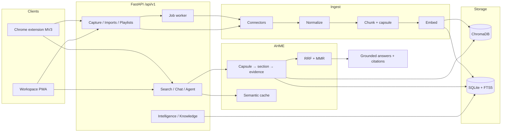

# AI Memory Agent

**Version 1.9.0** — a self-hosted personal memory system that turns saved YouTube videos, web pages, PDFs, GitHub repos, and bookmarks into searchable knowledge with grounded, cited answers.

Chrome extension (Manifest V3) + FastAPI backend + AI Memory Workspace (PWA).

> **Status:** Version 1 track complete (**V1-0 … V1-9**). Phase 1 Production Hardening is now implemented across CLI tooling, CI benchmark smoke, observability, deploy probes, strict tenant retrieval, and legacy tenant backfill. Canonical inventory: [`MASTER_SPEC.md`](MASTER_SPEC.md).

---

## Problem

Browsing creates useful knowledge that is hard to find later: transcripts, articles, READMEs, and bookmarks live in separate tools and keyword search rarely matches how you remember them.

**AHME (Adaptive Hierarchical Memory Engine)** is the retrieval core of this project. It treats personal saves as a layered memory store — capsules → sections → evidence — and answers questions with hybrid ranking (dense vectors + lexical FTS), diversification, and citation-backed synthesis.

---

## Current capabilities

### Implemented

| Area | What works |
|------|------------|
| **Capture** | Explicit save from the active tab (no URL copy); context menu save; SSRF-safe web fetch |
| **Connectors** | YouTube (reference), web articles, PDF, GitHub (public README/metadata), bookmark import |
| **Ingest pipeline** | Metadata/transcript extraction → normalization → chunking → embeddings → Chroma + FTS + universal memory |
| **AHME retrieval** | Hierarchical coarse-to-fine search with RRF fusion, MMR diversification, semantic cache, deduplication; flat fallback |
| **Ask / RAG** | Grounded answers with source citations; optional LLM providers; deterministic synthesis when `LLM_PROVIDER=none` |
| **Memory intelligence** | Topics, learning graph, timeline, roadmaps, duplicates, creators, explainable retrieve (`/intelligence/*`) |
| **Knowledge graph** | Entity/relation foundation + APIs (`/knowledge/*`) |
| **Jobs** | Background playlist/import ingest with pause / resume / retry / cancel |
| **Workspace PWA** | Dashboard, search, Ask Memory, playlists, imports, privacy controls (`app/static`) |
| **Extension** | Observe + Save, command bar (`search`, `ask`, `import …`, `help`), deep-links into Workspace |
| **Auth & privacy** | Optional sessions, strict user-scoped retrieval, export/delete, rate limiting, hosted `/privacy` |
| **Trust / lifecycle** | Memory state machine + trust scoring foundation (API + demo surfaces) |
| **Production hardening** | Safe operator CLIs, benchmark CI smoke, request IDs/metrics, liveness/readiness probes, legacy tenant metadata migration |

### Not yet implemented

Planned for later roadmap phases:

- Ontology engine
- Consensus / Gap engines
- Autonomous multi-agent orchestration / marketplace
- Watch Later via Google OAuth (use a **public playlist URL** for demos)
- Full connector SDK marketplace and enterprise multi-tenant scale-out

Also out of scope for V1: covert recording, keylogging, password capture, and Incognito support.

---

## Architecture

End-to-end flow for what exists in the repository today:

```
Capture / import
  → extraction (transcript, HTML, PDF text, README, …)
  → normalization (NormalizedItem / Universal Memory)
  → chunking + optional memory capsule
  → embeddings (Sentence Transformers)
  → vector storage (ChromaDB) + FTS5 + SQLite registry
  → AHME retrieval / ranking (hierarchical → RRF → MMR)
  → grounded answer synthesis (citations)
```

### Data flow



Primary modules: `app/services/ingest_service.py`, `connector_ingest_service.py`, `ahme_engine.py`, `chat_service.py`, `sources/*`.

---

## AI/ML and retrieval

| Capability | Implementation |
|------------|----------------|
| Semantic search | Dense embeddings over chunked content; query embedding at retrieve time |
| Embeddings | Sentence Transformers (`sentence-transformers/all-MiniLM-L6-v2`, lazy singleton) |
| Vector store | ChromaDB persistent collections (`memory_items`, capsules, sections) |
| Hybrid retrieval | Vector ranks + SQLite FTS5, fused with **RRF** |
| Diversification | **MMR** over candidate evidence |
| Hierarchical retrieval | Capsule → video narrow → section → evidence (`hierarchical_retrieval_enabled`) |
| Semantic cache | Cosine similarity over question embeddings (TTL + threshold) |
| Deduplication | Content / chunk hashes, near-duplicate simhash, cross-connector URL/content checks |
| RAG / grounded answers | Retrieve → optional clarify → synthesize with citations; LLM optional |
| Model abstraction | `LLM_PROVIDER=none` \| `ollama` \| `openai_compatible` for capsules/synthesis |
| Memory intelligence | Topic profiles, learning edges, concept capsules, related-memory signals |
| Knowledge graph | Foundation entity linking and graph APIs (not a full ontology engine) |

---

## System engineering

- **API:** FastAPI routers under `/api/v1` (capture, videos, search, chat, jobs, agent, auth, privacy, intelligence, knowledge, …)
- **Async work:** In-process job worker for playlist/import pipelines (`JOBS_ENABLED`)
- **Storage:** SQLite (registry, FTS, jobs, auth, intelligence) + ChromaDB on disk
- **Clients:** Chrome MV3 extension; static PWA with service worker (`app/static`)
- **Security:** Optional auth sessions, tenant-scoped vector queries, CORS for localhost + extension origins, SSRF-safe fetch, in-process rate limits
- **Privacy:** Explicit save only; export/delete APIs; privacy policy page; Incognito disabled
- **Ops:** Dockerfile + `docker-compose.yml` (single uvicorn worker); request IDs + lightweight metrics; separate liveness/readiness probes; GitHub Actions CI runs tests + benchmark smoke

---

## Tech stack

| Layer | Technologies |
|-------|----------------|
| **Backend** | Python 3.11, FastAPI, Uvicorn, Pydantic Settings |
| **AI / ML** | Sentence Transformers, optional Ollama / OpenAI-compatible LLM |
| **Retrieval** | AHME, RRF, MMR, FTS5, semantic cache, grounded synthesis |
| **Storage** | ChromaDB, SQLite |
| **Frontend / browser** | Chrome extension (MV3), static PWA (`app/static`) |
| **Connectors** | youtube-transcript-api, yt-dlp, trafilatura, pypdf, GitHub public API |
| **Testing** | pytest, pytest-asyncio, httpx |
| **Infra** | Docker / Compose, GitHub Actions (`.github/workflows/ci.yml`) |

---

## Engineering highlights

- End-to-end **RAG pipeline** with a real hierarchical retrieval engine, not a thin wrapper around a single vector query
- **Hybrid ranking** (dense + lexical) with RRF/MMR and safe flat fallback when hierarchical path fails
- **Connector abstraction** that normalizes heterogeneous sources into one memory + index path
- **Grounded answers by default** — deterministic synthesis works without an LLM
- **Self-hosted, user-owned memory** with export/delete and documented privacy boundaries
- **Fail-closed tenant isolation** for authenticated users, including migration support for historical local-default data
- Modular FastAPI services with feature flags (`HIERARCHICAL_RETRIEVAL_ENABLED`, `AUTH_ENABLED`, `JOBS_ENABLED`, …)

---

## Quick start

Requires **Python 3.11**. A clean virtualenv is recommended.

```bash
python3.11 -m venv .venv_clean
source .venv_clean/bin/activate
pip install -r requirements.txt
cp .env.example .env

JOBS_ENABLED=true AUTH_ENABLED=false PWA_ENABLED=true \
  uvicorn app.main:app --host 0.0.0.0 --port 8000
```

| Surface | URL |
|---------|-----|
| Workspace PWA | http://localhost:8000/ |
| API docs (Swagger) | http://localhost:8000/docs |
| Liveness | http://localhost:8000/api/v1/live |
| Readiness | http://localhost:8000/api/v1/ready |
| Metrics | http://localhost:8000/api/v1/metrics |
| Privacy | http://localhost:8000/privacy |

### Chrome extension

1. Open `chrome://extensions` → enable **Developer mode** → **Load unpacked** → select `extension/`
2. In the popup, set API base to `http://127.0.0.1:8000/api/v1`
3. Open a YouTube video → **Save To Memory**

Details: [`extension/README.md`](extension/README.md)

### Operator tools

Ingest one YouTube item:

```bash
python scripts/ingest_item.py "https://www.youtube.com/watch?v=VIDEO_ID"
```

Preview/reset configured local data:

```bash
python scripts/reset_db.py --dry-run
python scripts/reset_db.py --yes
```

Preview/apply the legacy tenant metadata migration:

```bash
python scripts/backfill_legacy_user_ids.py --dry-run
python scripts/backfill_legacy_user_ids.py --yes
```

Full deployment, backup, restore, health-check, and incident guidance: [`docs/OPERATIONS_RUNBOOK.md`](docs/OPERATIONS_RUNBOOK.md).

### Optional: demo seed & Docker

```bash
python scripts/seed_demo.py
```

```bash
docker compose up --build
```

Demo recording outline: [`docs/V1_DEMO_SCRIPT.md`](docs/V1_DEMO_SCRIPT.md)

---

## Testing

Run the current full suite rather than relying on a hard-coded test count:

```bash
source .venv_clean/bin/activate
pytest -q
```

AHME benchmark smoke:

```bash
BENCHMARK_RUNS=1 python scripts/benchmark_ahme.py
```

CI (`.github/workflows/ci.yml`) installs dependencies, checks `VERSION` ↔ `extension/manifest.json`, runs the test suite, and executes the benchmark smoke gate on push/PR.

---

## Version status

| Track | Status |
|-------|--------|
| **V1 / V1.9.0** | Complete (V1-0 … V1-9): ingest, AHME, connectors, Workspace, extension command bar, auth/privacy, demo/store package, CI |
| **Phase 1 hardening** | Implemented: operator CLI, CI benchmark smoke, observability baseline, deploy probes, strict tenant retrieval, legacy tenant backfill, operations runbook |
| **Next** | Phase 2 Memory Intelligence per `MASTER_SPEC.md`; later planned phases remain blocked until earlier acceptance criteria are validated |

See [`docs/V1_RELEASE_PLAN.md`](docs/V1_RELEASE_PLAN.md), [`docs/V1_9_DEMO_STORE_LAUNCH.md`](docs/V1_9_DEMO_STORE_LAUNCH.md), and [`MASTER_SPEC.md`](MASTER_SPEC.md).

---

## Documentation

| Doc | Purpose |
|-----|---------|
| [`MASTER_SPEC.md`](MASTER_SPEC.md) | Canonical feature inventory and execution status |
| [`docs/OPERATIONS_RUNBOOK.md`](docs/OPERATIONS_RUNBOOK.md) | Single-node deployment, health, backup/restore, migration, incident and release runbook |
| [`KNOWLEDGE_ENGINE.md`](KNOWLEDGE_ENGINE.md) | AHME + knowledge-engine architecture (implemented vs planned) |
| [`CONNECTOR_SDK.md`](CONNECTOR_SDK.md) | Connector architecture notes (see also V1-4) |
| [`docs/V1_PRODUCT_SPEC.md`](docs/V1_PRODUCT_SPEC.md) | V1 product scope |
| [`docs/V1_PLATFORM_CAPABILITY_MATRIX.md`](docs/V1_PLATFORM_CAPABILITY_MATRIX.md) | Capability audit (historical; prefer MASTER_SPEC for latest status) |
| [`docs/V1_PRIVACY_MODEL.md`](docs/V1_PRIVACY_MODEL.md) | Privacy model |
| [`docs/V1_3_MEMORY_INTELLIGENCE.md`](docs/V1_3_MEMORY_INTELLIGENCE.md) | Memory intelligence layer |
| [`docs/V1_4_UNIVERSAL_CONNECTORS.md`](docs/V1_4_UNIVERSAL_CONNECTORS.md) | Universal connectors |
| [`docs/V1_5_MEMORY_WORKSPACE.md`](docs/V1_5_MEMORY_WORKSPACE.md) | Workspace PWA |
| [`docs/V1_8_AUTH_PRIVACY.md`](docs/V1_8_AUTH_PRIVACY.md) | Auth, isolation, rate limits |
| [`docs/V1_9_DEMO_STORE_LAUNCH.md`](docs/V1_9_DEMO_STORE_LAUNCH.md) | Final V1 milestone |
| [`SECURITY.md`](SECURITY.md) | Security policy |

---

## License

MIT — see [`LICENSE`](LICENSE).